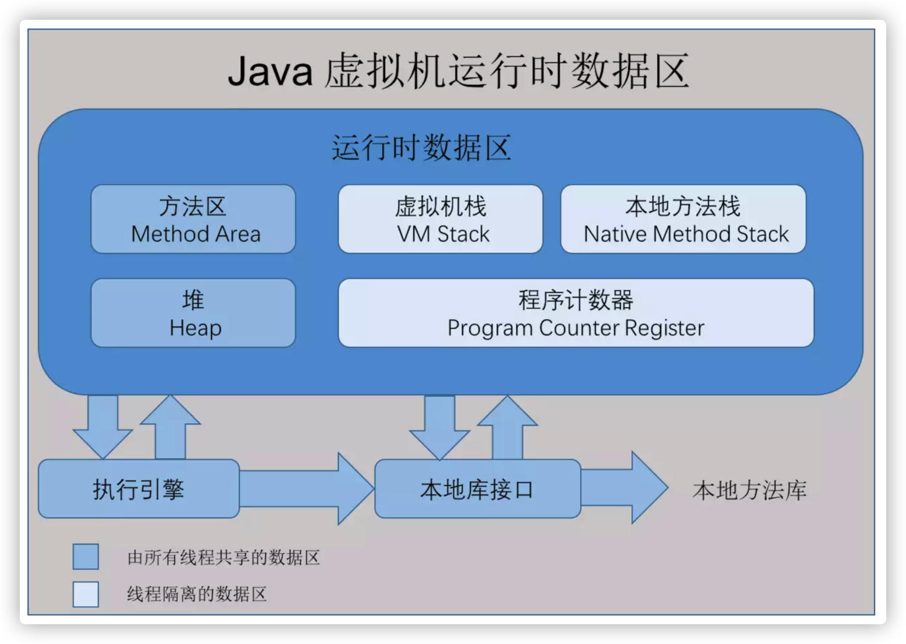
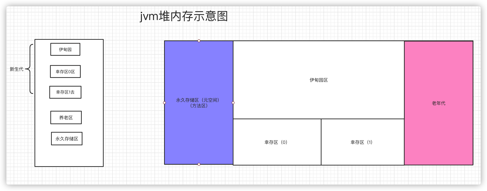

# Java运行时的数据区域

Java虚拟机在执行Java程序的过程中会把他所管理的内存划分为不同的数据区域，这些区域各有各的作用，也各有各的声明周期

虚拟机栈、本地方法区、程序计数器一定不会有垃圾。

## 程序计数器

一块较小的内存空间，是当前线程所执行的字节码的行号指示器。在jvm中，字节码解释器通过改变这个程序计数器的值，来控制程序的分支、跳转、异常处理、线程恢复等功能

## Java虚拟机栈

虚拟机栈描述的是Java方法执行的线程内存模型：每个方法被执行的时候，Java虚拟机都会同步创建一个栈帧，用于存储`局部变量表`，操作数栈、动态连接，方法出入口等信息。每一个方法被调用直至执行完毕的过程，就对应着一个栈帧在虚拟机栈中从入栈到出栈的过程。

局部变量表： ==存放了编译器可知的各种Java虚拟机基本数据类型（boolean，byte，char，short，int，float，long，double）、对象引用和returnAddress类型。==

## 方法区

被所有的线程共享，所有的字段和方法字节码、以及一些特殊的方法、如构造函数、接口代码也在此定义，简单说，所有定义的方法的信息都在此处，此区域属于共享空间。

==静态变量、常量、类信息（构造方法、接口定义）、运行时的常量池存在方法区中，但是实际变量存在堆方法中，与方法区无关==

static  final Class模板、常量池

## 堆（Heap）

一个jvm只有一个JVM，堆内存的大小是可以调节的

堆内存中要分为三个地方

* 新生区
* 养老区
* 永久区

垃圾回收主要是在伊甸园区和养老区

在jdk8以后，永久存储区改了一个名字（元空间）；

### 新生区

* 类诞生和成长甚至死亡的地方
* 伊甸园区，所有的对象都是在伊甸园区new出来的
* 幸存区（0，1）

真相：经过研究，有90的的类都存活不到养老区

### 永久区

这个区域常驻内存，用来存储JDK自带的Class对象，Interface元数据，存储的java运行时的一些内存和类信息，这个区域不存在垃圾回收，关闭虚拟机会释放这个区域的内存。

* jdk1.6之前：永久代，常量池在方法区中
* Jdk1.7 :去永久代，常量池在堆中
* Jdk1.8 ：元空间，常量池在元空间中

GC

GC两种类型：轻GC，

重GC

GC算法

- 标记清除法
- 标记压缩法
- 引用计数法
- 复制算法

# 类加载器

==class 是抽象的，用new 关键字出来的才是具体的类。==

## 作用

加载class文件

## 分类

1. 虚拟机自带的加载器

2. 启动类（根）加载器 bootstrap class loader

   c++编写，主要针对于rt.jar

3. 拓展类加载器 extension class loader

   主要针对于ext底下的包

4. 应用程序加载器 app  

   主要针对于用户路径下的包

## 双亲委派机制（双亲委派模型在jdk1.2的时候被引入）

如果一个类加载器收到了类加载的请求，首先他不会自己去尝试加载这个类，而是把这个请求委派给父类加载器去完成，每一个层次的类加载器都是如此，因此所有的加载请求最终都应该传送到最顶层的类加载器中。只有当父类加载器反馈自己无法完成这个类加载请求时，子加载器才会尝试自己去调用类加载。

作用：

1、防止重复加载同一个`.class`。通过委托去向上面问一问，加载过了，就不用再加载一遍。保证数据安全。
 2、保证核心`.class`不能被篡改。通过委托方式，不会去篡改核心`.clas`，即使篡改也不会去加载，即使加载也不会是同一个`.class`对象了。不同的加载器加载同一个`.class`也不是同一个`Class`对象。这样保证了`Class`执行安全。

# Native 关键字、方法区

凡是带有native关键字的，说明java的作用范围达不到了，会去调用底层c语言的库。

会调用本地方法栈

调用本地方法接口（JNI）

JNI作用：拓展java使用，融合不同语言为java所用

历史：java诞生之初 C  C++ 横行，想要立足 必须调用C和C++的方法

# 三种java虚拟机

1. HotSpot （sun公司）
2. BEA JRockit
3. IBM J9 Vm