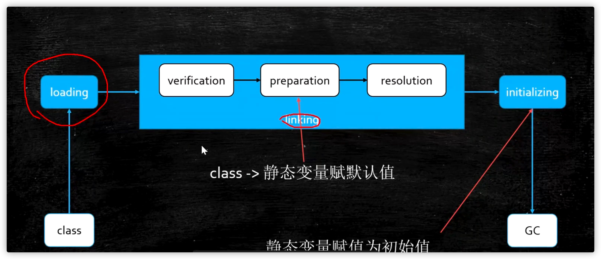

今天来学习一下从class到jvm类加载初始化的过程

<!--more-->



第一步：将class文件load到内存中，其中包含以下的知识点

- 双亲委派

- 类加载器

  ```java
  protected Class<?> loadClass(String name, boolean resolve)
          throws ClassNotFoundException
      {
          synchronized (getClassLoadingLock(name)) {
              // First, check if the class has already been loaded
              Class<?> c = findLoadedClass(name);
              if (c == null) {
                  long t0 = System.nanoTime();
                  try {
                      if (parent != null) {
                          c = parent.loadClass(name, false);
                      } else {
                          c = findBootstrapClassOrNull(name);
                      }
                  } catch (ClassNotFoundException e) {
                      // ClassNotFoundException thrown if class not found
                      // from the non-null parent class loader
                  }
  
                  if (c == null) {
                      // If still not found, then invoke findClass in order
                      // to find the class.
                      long t1 = System.nanoTime();
                      c = findClass(name);
  
                      // this is the defining class loader; record the stats
                      sun.misc.PerfCounter.getParentDelegationTime().addTime(t1 - t0);
                      sun.misc.PerfCounter.getFindClassTime().addElapsedTimeFrom(t1);
                      sun.misc.PerfCounter.getFindClasses().increment();
                  }
              }
              if (resolve) {
                  resolveClass(c);
              }
              return c;
          }
      }
  
  ```

- 自定义classloader（重写findclass）

  将文件转换为字节

  ```java
  public class CustomerClassLoader extends ClassLoader {
      @Override
      protected Class<?> findClass(String name) throws ClassNotFoundException {
          File file = new File("/Users/cooper/Projects/Cooper/StudyPlan/mrhy-grow-up/mrhy-jvm/target/classes/", name.replaceAll(".", "/").concat(".class"));
          try {
              FileInputStream fileInputStream = new FileInputStream(file);
              ByteArrayOutputStream byteArrayOutputStream = new ByteArrayOutputStream();
              int b = 0;
              while ((b = fileInputStream.read()) != 0) {
                  byteArrayOutputStream.write(b);
              }
              byte[] bytes = byteArrayOutputStream.toByteArray();
              byteArrayOutputStream.close();
              fileInputStream.close();
              return defineClass(name, bytes, 0, bytes.length);
          } catch (Exception e) {
              e.printStackTrace();
          }
  
          return super.findClass(name);
      }
  
      public static void main(String[] args) throws Exception {
          CustomerClassLoader customerClassLoader=new CustomerClassLoader();
          Class<?> aClass = customerClassLoader.loadClass("com.mrhy.jvm.test.Hello");
          Hello hello = (Hello)aClass.newInstance();
          hello.sayHello();
          System.out.println(hello.getClass().getClassLoader());
          System.out.println(hello.getClass().getClassLoader().getClass().getClassLoader());
      }
  }
  ```

- 破坏双亲委派机制（重写classloader）

第二步：linking

- verification

  验证文件是否符合jvm规范

- preparation

  为静态变量赋值

- resolution

  解析（resolve）

  将类、方法、属性等符号引用解析为直接引用，常量池中的各种符号引用解析为指针。

第三步。Initialingzing
