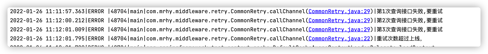
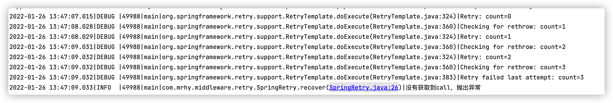
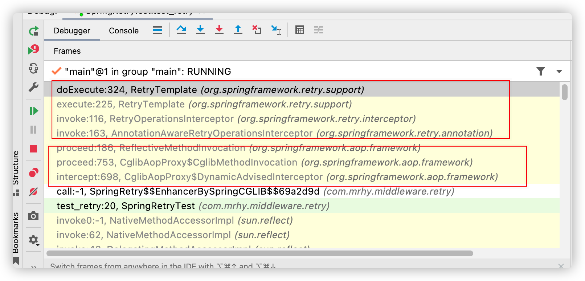

今天开始整活，使用springRetry，根据why哥的公众号推荐，今天我们也来研究一下。具体文章地址为：

https://mp.weixin.qq.com/s/XkKKBWnpAIbMxtLYRY4o-Q

<!--more-->

# 功能

spring-retry顾名思义，是一个用来重试的组件，在现实中，我们调第三方服务，碰到有异常的时候会有重试机制，代码为

```java
package com.mrhy.middleware.retry;

import lombok.extern.slf4j.Slf4j;
import org.springframework.stereotype.Component;

import java.util.concurrent.TimeoutException;

/**
 * @author cooper
 * @description 平常的代码
 * @date 2022/1/25 2:24 PM
 */
@Slf4j
@Component
public class CommonRetry {
    private static final Integer FINAL_RETRY_COUNT = 3;

    public void callChannel() throws Exception {
        int retryCount = 0;
        for (int i = 0; i <= FINAL_RETRY_COUNT; i++) {
            if (retryCount >= FINAL_RETRY_COUNT) {
                log.error("重试次数超过上线，");
                throw new Exception("连接超时");
            }
            try {
                queryOrder();
                break;
            } catch (TimeoutException e) {
                retryCount++;
                log.error("第{}次查询接口失败,要重试", retryCount);
            }
        }
    }

    private void queryOrder() throws TimeoutException {
        throw new TimeoutException("查询订单超时");
    }
}

```

调用这个接口结果为



上述的功能代码看起来一点都不优雅，且容易在for循环和失败次数上面徘徊，于是我们就引入了spring-retry这个组件

# 组件

组件的官网地址为：

https://github.com/spring-projects/spring-retry

引入组件

```pom
  			<dependency>
            <groupId>org.springframework.retry</groupId>
            <artifactId>spring-retry</artifactId>
        </dependency>
        // 依赖aop，所以需要引入aop的组件
           <dependency>
            <groupId>org.springframework.boot</groupId>
            <artifactId>spring-boot-starter-aop</artifactId>
            <exclusions>
                <exclusion>
                    <groupId>org.springframework.boot</groupId>
                    <artifactId>spring-boot-starter-logging</artifactId>
                </exclusion>
            </exclusions>
        </dependency>
```

# DEMO

```java
@Component
@Slf4j
public class SpringRetry {


    @Retryable
    public void call() throws Exception {
        throw new Exception("我出错了");
    }

    @Recover
    public void recover(Exception e) {
     log.info("没有获取到call，抛出异常");
    }
}
```



从上面的代码中可以看到，spring-retry默认是重试3次。

# 源码解析

首先我们找到RetryTemplate这个类，对第324行打断点，并重新观察调用栈



