本篇文章主要去记录对于springboot中默认线程池的研究与理解，正好借此机会复习一下如何查看springboot源码

<!--more-->

> 花5分钟搭建一个springboot的项目

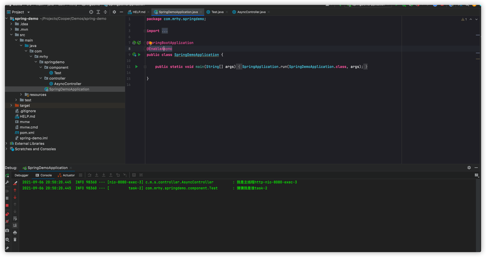

> 开始写代码

```java
package com.mrhy.springdemo.component;

import org.slf4j.Logger;
import org.slf4j.LoggerFactory;
import org.springframework.scheduling.annotation.Async;
import org.springframework.stereotype.Component;

/**
 * @description:
 * @author: cooper
 * @date: 2021/7/9 12:44 下午
 */
@Component
public class Test {
    private final Logger logger = LoggerFactory.getLogger(this.getClass().getName());

    @Async
    public void testAsync(){
        logger.info("猜猜我是谁{}",Thread.currentThread().getName());
    }
}

```

```java
package com.mrhy.springdemo.controller;

import com.mrhy.springdemo.component.Test;
import org.slf4j.Logger;
import org.slf4j.LoggerFactory;
import org.springframework.beans.factory.annotation.Autowired;
import org.springframework.web.bind.annotation.GetMapping;
import org.springframework.web.bind.annotation.RequestMapping;
import org.springframework.web.bind.annotation.RestController;

/**
 * @author cooper
 * @description
 * @date 2021/9/6 8:38 下午
 */
@RequestMapping("/async")
@RestController
public class AsyncController {
    private final Logger logger = LoggerFactory.getLogger(this.getClass().getName());

    @Autowired
    Test test;

    @GetMapping("/test")
    public void test() {
        logger.info("我是主线程{}", Thread.currentThread().getName());
        test.testAsync();
    }

}

```

> 调用

```shell
curl http://localhost:8080/async/test
```

> 查看结果

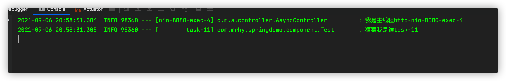

## async源码探究

> 首先研究一下注解

```java
import java.lang.annotation.Documented;
import java.lang.annotation.ElementType;
import java.lang.annotation.Retention;
import java.lang.annotation.RetentionPolicy;
import java.lang.annotation.Target;

/**
 * Annotation that marks a method as a candidate for <i>asynchronous</i> execution.
 * Can also be used at the type level, in which case all of the type's methods are
 * considered as asynchronous. Note, however, that {@code @Async} is not supported
 * on methods declared within a
 * {@link org.springframework.context.annotation.Configuration @Configuration} class.
 *
 * <p>In terms of target method signatures, any parameter types are supported.
 * However, the return type is constrained to either {@code void} or
 * {@link java.util.concurrent.Future}. In the latter case, you may declare the
 * more specific {@link org.springframework.util.concurrent.ListenableFuture} or
 * {@link java.util.concurrent.CompletableFuture} types which allow for richer
 * interaction with the asynchronous task and for immediate composition with
 * further processing steps.
 *
 * <p>A {@code Future} handle returned from the proxy will be an actual asynchronous
 * {@code Future} that can be used to track the result of the asynchronous method
 * execution. However, since the target method needs to implement the same signature,
 * it will have to return a temporary {@code Future} handle that just passes a value
 * through: e.g. Spring's {@link AsyncResult}, EJB 3.1's {@link javax.ejb.AsyncResult},
 * or {@link java.util.concurrent.CompletableFuture#completedFuture(Object)}.
 *
 * @author Juergen Hoeller
 * @author Chris Beams
 * @since 3.0
 * @see AnnotationAsyncExecutionInterceptor
 * @see AsyncAnnotationAdvisor
 */
翻译：这个注解标志着方式是异步执行的。 也可以在类型级别使用，在这种情况下，所有类型的方法都被视为异步。 但是请注意，这@Async不支持方法内声明@Configuration类。
在目标方法签名方面，支持任何参数类型。 但是，返回类型被限制为void或java.util.concurrent.Future 。 在后一种情况下，您可以声明更具体的org.springframework.util.concurrent.ListenableFuture或java.util.concurrent.CompletableFuture类型，它们允许与异步任务进行更丰富的交互，并允许与进一步处理步骤的立即组合。
从代理返回的Future句柄将是一个实际的异步Future ，可用于跟踪异步方法执行的结果。 然而，由于目标方法需要实现相同的签名，它必须返回一个临时的Future句柄，它只是传递一个值：例如 Spring 的AsyncResult 、EJB 3.1 的javax.ejb.AsyncResult或java.util.concurrent.CompletableFuture.completedFuture(Object) 


@Target({ElementType.TYPE, ElementType.METHOD})
@Retention(RetentionPolicy.RUNTIME)
@Documented
public @interface Async {

	/**
	 * A qualifier value for the specified asynchronous operation(s).
	 * <p>May be used to determine the target executor to be used when executing
	 * the asynchronous operation(s), matching the qualifier value (or the bean
	 * name) of a specific {@link java.util.concurrent.Executor Executor} or
	 * {@link org.springframework.core.task.TaskExecutor TaskExecutor}
	 * bean definition.
	 * <p>When specified on a class-level {@code @Async} annotation, indicates that the
	 * given executor should be used for all methods within the class. Method-level use
	 * of {@code Async#value} always overrides any value set at the class level.
	 * @since 3.1.2
	 */
  
 指定异步操作的限定符值。
可用于确定执行异步操作时要使用的目标执行程序，匹配特定Executor或TaskExecutor bean 定义的限定符值（或 bean 名称）。
当在类级别@Async注释上指定时，表示给定的执行程序应该用于类中的所有方法。 Async#value方法级别使用始终覆盖在类级别设置的任何值。
	String value() default "";

}
```

1. @Async可以是方法，可以是类（类中全部方法均为异步）
2. @Async不能和@Configuration同时修饰
3. 返回值必须为void或者Futrue对象。
4. 如果方法中和类中同时有这个注解，方法上的优先级高

> 追根

点击.value 注解，发现其源码只有一出引用，其他均为注释（良心方法）QAQ

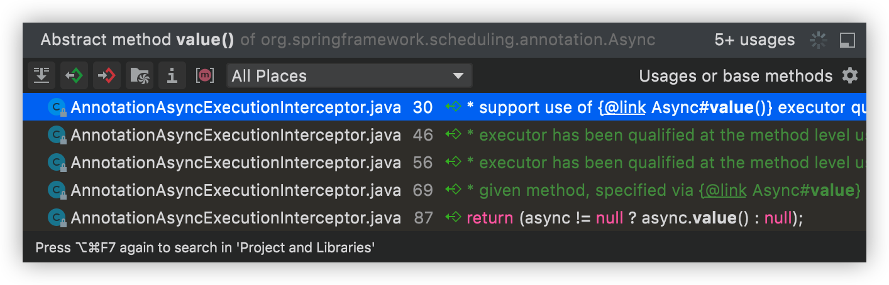

我们点击第4个可以进入一个方法

```json

	/**
	 * Return the qualifier or bean name of the executor to be used when executing the
	 * given method, specified via {@link Async#value} at the method or declaring
	 * class level. If {@code @Async} is specified at both the method and class level, the
	 * method's {@code #value} takes precedence (even if empty string, indicating that
	 * the default executor should be used preferentially).
	 * @param method the method to inspect for executor qualifier metadata
	 * @return the qualifier if specified, otherwise empty string indicating that the
	 * {@linkplain #setExecutor(Executor) default executor} should be used
	 * @see #determineAsyncExecutor(Method)
	 */
翻译：返回要执行的bean的名称，方法的优先级高于类中的优先级
	@Override
	@Nullable
	protected String getExecutorQualifier(Method method) {
		// Maintainer's note: changes made here should also be made in
		// AnnotationAsyncExecutionAspect#getExecutorQualifier
		Async async = AnnotatedElementUtils.findMergedAnnotation(method, Async.class);
		if (async == null) {
			async = AnnotatedElementUtils.findMergedAnnotation(method.getDeclaringClass(), Async.class);
		}
		return (async != null ? async.value() : null);
	}
```

上述代码的意思是：先获取方法上的注释，如果没有则获取类上的注释。 

项目启动后第一次调用会走这个方法，让我们看一下

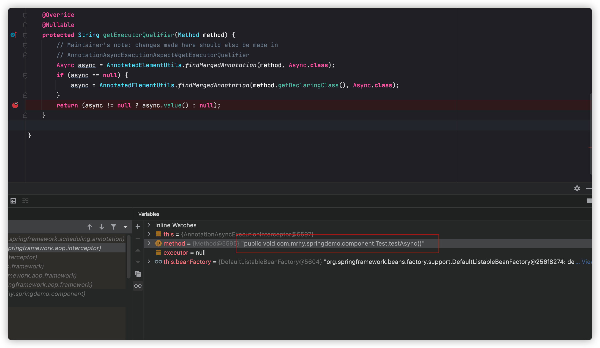

跟着方法看他的上层调用的地方，来到了如下的方法

==org.springframework.aop.interceptor.AsyncExecutionAspectSupport==

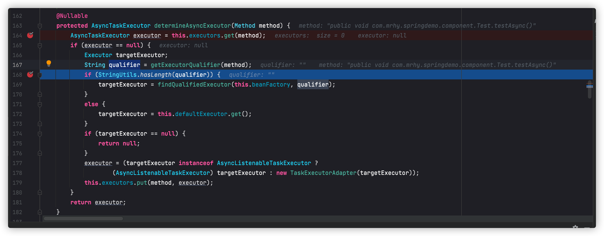

看这个qualifier是否为空，如果不为空，找上面的线程池，如果没有，则获取默认的。

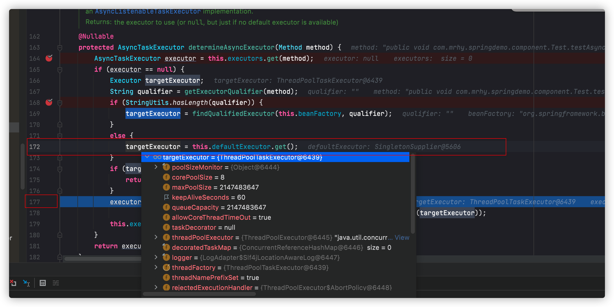

当代码执行到第177行的时候，就已经获取默认的线程池了，线程池的属性配置如下

```tex
核心线程：8
最大线程数:Interger.MAX_VALUE
队列长度:Interger.MAX_VALUE
空闲线程存活时间:60s
```

根据以上属性我们有理由判断出：

==如果我们用默认线程池，当异步线程太多的时候，完全可能存在oom的问题==

我们反回来说上面的方法。

那重点就是172行

==targetExecutor = this.defaultExecutor.get();==

问题来了

> 1.  defaultExecutor是什么
>
> 2. 是怎么get到默认线程池的

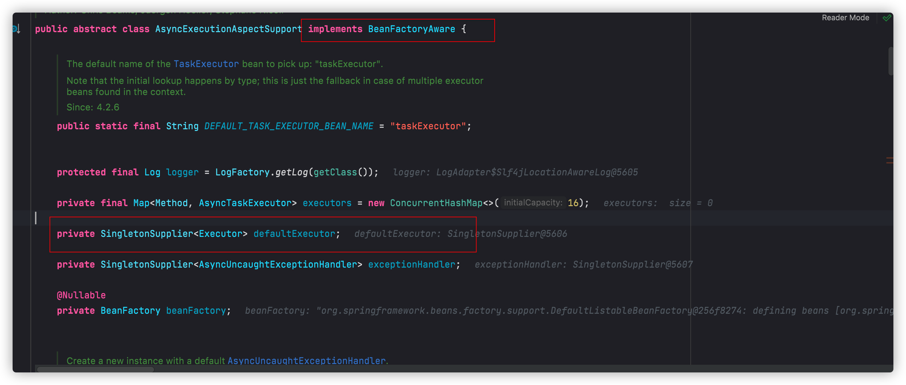

看我标红的位置： 1.  Implements BeanFactoryAware

setBeanFactory 获取bean工厂，然后可以拿到很多信息。

实现了BeanFactoryAware接口的bean，可以直接通过beanfactory来访问spring的容器，当该bean被容器创建以后，会有一个相应的beanfactory的实例引用，该 接口有一个方法void setBeanFactory(BeanFactory beanFactory)方法通过这个方法的参数创建它的BeanFactory实例，实现了BeanFactoryAware接口，就可以让Bean拥有访问Spring容器的能力。

```java
@Override
public void setBeanFactory(BeanFactory beanFactory) {
   this.beanFactory = beanFactory;
}
```

2. SingleTonSupplier<Executor>defaultExecutor

看看这个地方是什么时候赋值的

```java
	public AsyncExecutionAspectSupport(@Nullable Executor defaultExecutor) {
		this.defaultExecutor = new SingletonSupplier<>(defaultExecutor, () -> getDefaultExecutor(this.beanFactory));
		this.exceptionHandler = SingletonSupplier.of(SimpleAsyncUncaughtExceptionHandler::new);
	}
```

首先看``new SingletonSupplier<>(defaultExecutor, () -> getDefaultExecutor(this.beanFactory));``

看构造函数

```java

	/**
	 * Build a {@code SingletonSupplier} with the given singleton instance
	 * and a default supplier for the case when the instance is {@code null}.
	 * @param instance the singleton instance (potentially {@code null})
	 * @param defaultSupplier the default supplier as a fallback
	 */
	public SingletonSupplier(@Nullable T instance, Supplier<? extends T> defaultSupplier) {
		this.instanceSupplier = null;
		this.defaultSupplier = defaultSupplier;
		this.singletonInstance = instance;
	}
```

查看get方法

```java

	/**
	 * Get the shared singleton instance for this supplier.
	 * @return the singleton instance (or {@code null} if none)
	 */
	@Override
	@Nullable
	public T get() {
		T instance = this.singletonInstance;
		if (instance == null) {
			synchronized (this) {
				instance = this.singletonInstance;
				if (instance == null) {
					if (this.instanceSupplier != null) {
						instance = this.instanceSupplier.get();
					}
					if (instance == null && this.defaultSupplier != null) {
						instance = this.defaultSupplier.get();
					}
					this.singletonInstance = instance;
				}
			}
		}
		return instance;
	}
```

标准的单例模式写法，

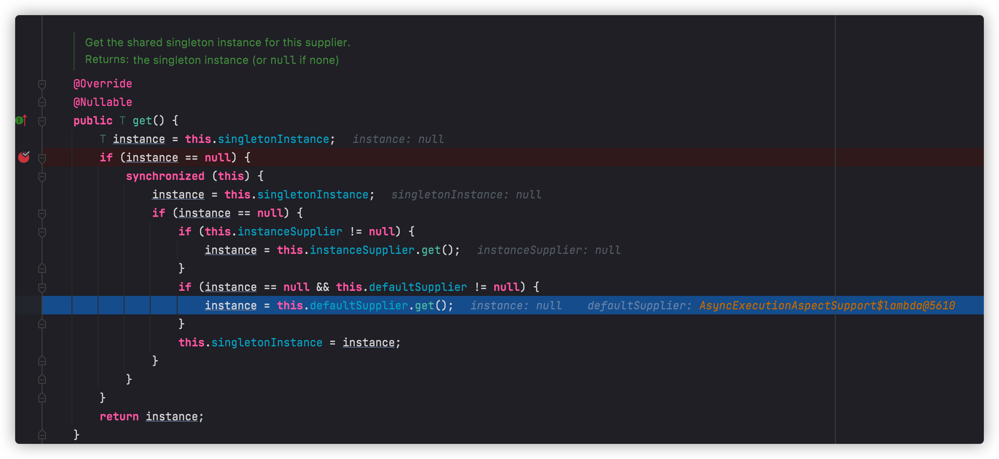

当第一次调用的时候，也是会调用Supplier的get，看一下这个get方法

```java

package java.util.function;
/**
 * Represents a supplier of results.
 *
 * <p>There is no requirement that a new or distinct result be returned each
 * time the supplier is invoked.
 *
 * <p>This is a <a href="package-summary.html">functional interface</a>
 * whose functional method is {@link #get()}.
 *
 * @param <T> the type of results supplied by this supplier
 *
 * @since 1.8
 
 代表结果的提供者。
没有要求每次调用供应商时都返回一个新的或不同的结果。
这是一个函数式接口，其函数式方法是get() 。
 */


@FunctionalInterface
public interface Supplier<T> {

    /**
     * Gets a result.
     *
     * @return a result
     */
    T get();
}

```

理解：

**1.supplier是个接口，有一个get()方法**

**2.语法 ：**

```html
Supplier<TestSupplier> sup= TestSupplier::new;
```

**3.每次调用get()方法时都会调用构造方法创建一个新对象。**

这个地方就是获取一个``ThreadPoolTaskExecutor``对象

锁定getDefaultExecutor

```java
/**
 * Retrieve or build a default executor for this advice instance.
 * An executor returned from here will be cached for further use.
 * <p>The default implementation searches for a unique {@link TaskExecutor} bean
 * in the context, or for an {@link Executor} bean named "taskExecutor" otherwise.
 * If neither of the two is resolvable, this implementation will return {@code null}.
 * @param beanFactory the BeanFactory to use for a default executor lookup
 * @return the default executor, or {@code null} if none available
 * @since 4.2.6
 * @see #findQualifiedExecutor(BeanFactory, String)
 * @see #DEFAULT_TASK_EXECUTOR_BEAN_NAME
 */
@Nullable
protected Executor getDefaultExecutor(@Nullable BeanFactory beanFactory) {
   if (beanFactory != null) {
      try {
         // Search for TaskExecutor bean... not plain Executor since that would
         // match with ScheduledExecutorService as well, which is unusable for
         // our purposes here. TaskExecutor is more clearly designed for it.
         return beanFactory.getBean(TaskExecutor.class);
      }
      catch (NoUniqueBeanDefinitionException ex) {
         logger.debug("Could not find unique TaskExecutor bean", ex);
         try {
            return beanFactory.getBean(DEFAULT_TASK_EXECUTOR_BEAN_NAME, Executor.class);
         }
         catch (NoSuchBeanDefinitionException ex2) {
            if (logger.isInfoEnabled()) {
               logger.info("More than one TaskExecutor bean found within the context, and none is named " +
                     "'taskExecutor'. Mark one of them as primary or name it 'taskExecutor' (possibly " +
                     "as an alias) in order to use it for async processing: " + ex.getBeanNamesFound());
            }
         }
      }
      catch (NoSuchBeanDefinitionException ex) {
         logger.debug("Could not find default TaskExecutor bean", ex);
         try {
            return beanFactory.getBean(DEFAULT_TASK_EXECUTOR_BEAN_NAME, Executor.class);
         }
         catch (NoSuchBeanDefinitionException ex2) {
            logger.info("No task executor bean found for async processing: " +
                  "no bean of type TaskExecutor and no bean named 'taskExecutor' either");
         }
         // Giving up -> either using local default executor or none at all...
      }
   }
   return null;
}
```

在bean中回去默认线程池

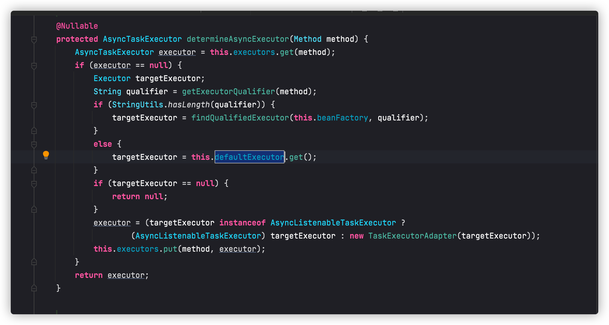

获取完成后，返回，并提交任务

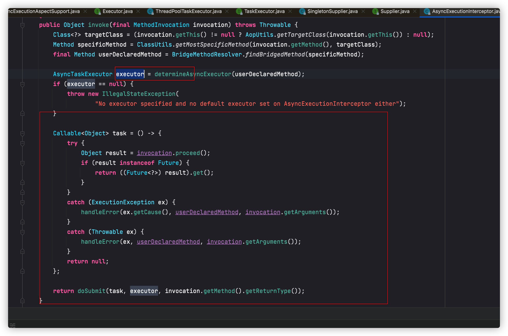

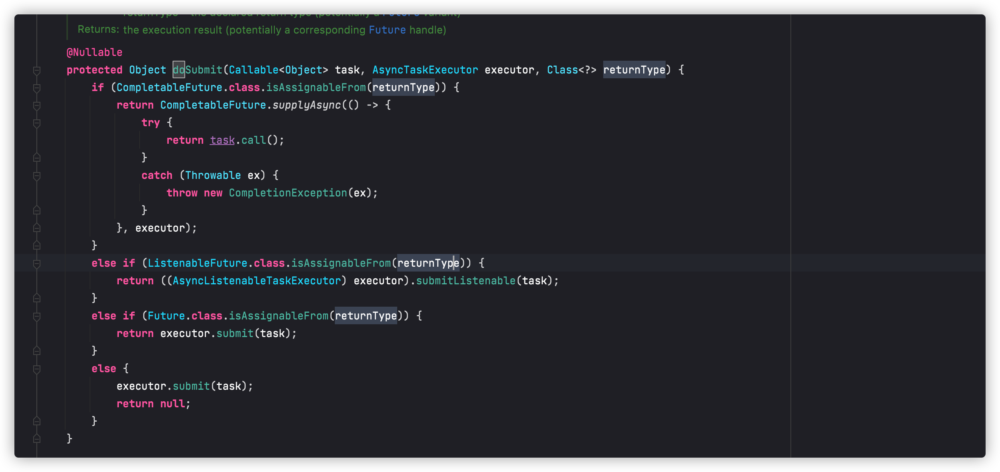

至此，所有的调用链我们已经理完

