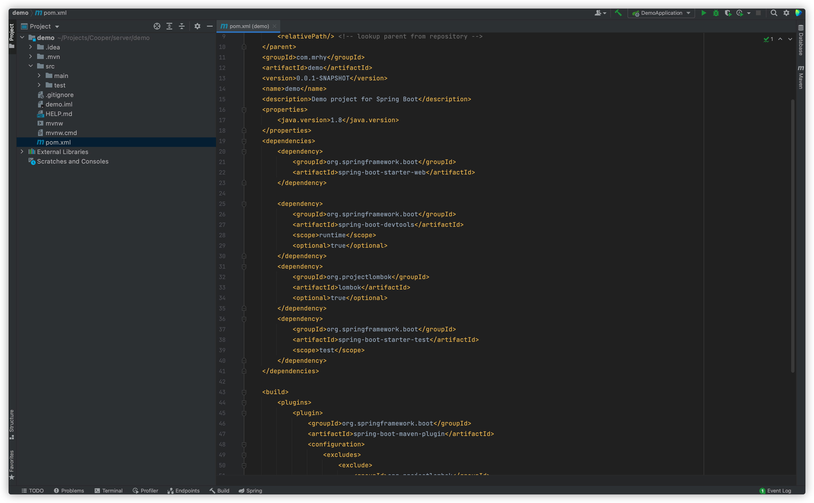
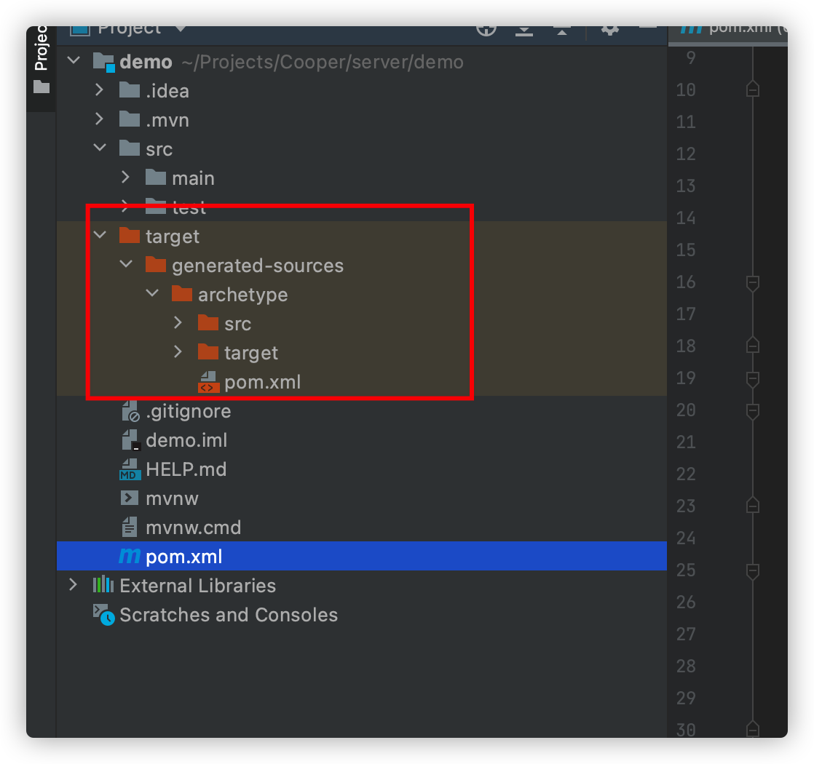
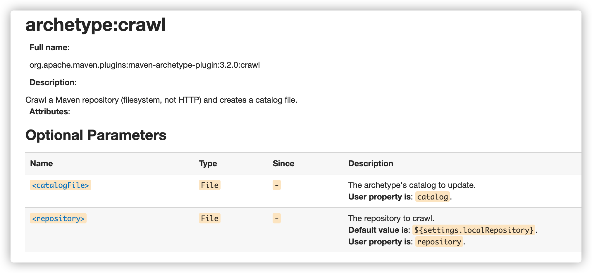
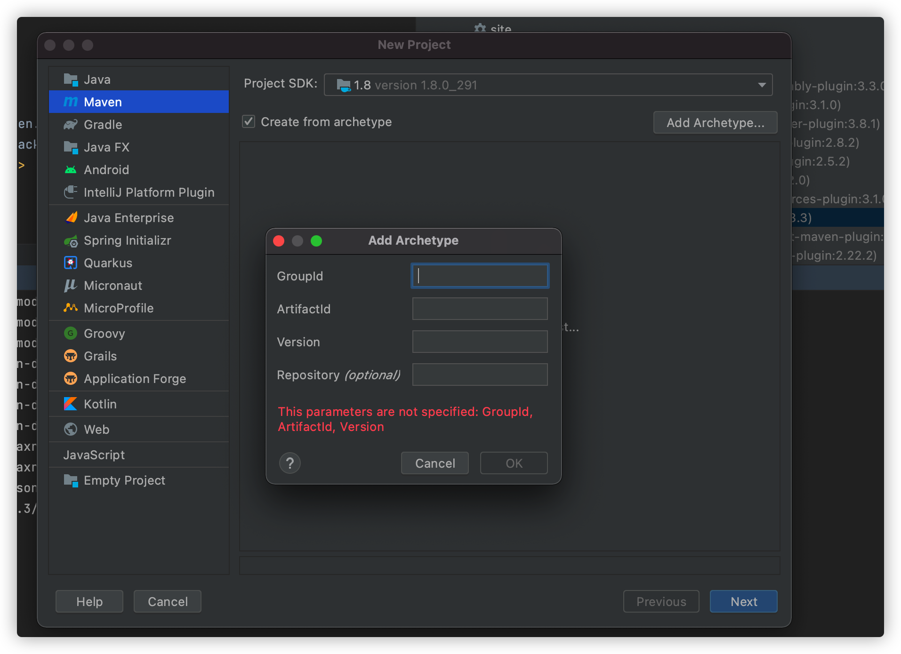
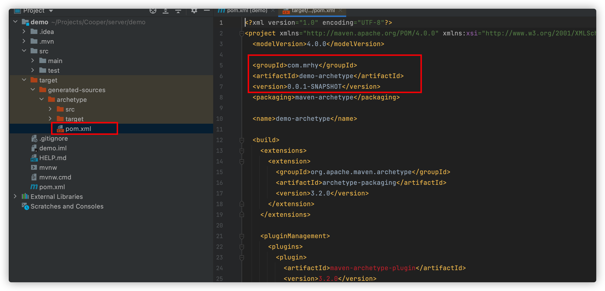

在我们实际开发过程中，好多项目的模板都是固定的，都要引用相同的包，一遍一遍的复制pom文件是一个办法，但是这种方法很浪费时间和精力，现在mvn为我们提供了一个archetype功能，现在记录一下，方便使用。

<!--more-->

# 创建模板项目

利用idea创建一个maven的项目，里面加上一些常用的包



# 生成archetype

1. 执行

```shell
mvn clean
```

2. 成功之后执行第二步

```shell
mvn archetype:create-from-project
```

3. 此时如果执行成功会在当前目录下生成一个target文件夹



4. 进入archetype目录，执行以下命令

```shell
mvn install
```

将项目打包成jar包，并安装在本地仓库

5. 执行如下命令

```shell
mvn archetype:crawl
```

看一下官网的解释



扫描仓库，并在仓库的目录下创建一个archetype-catalog.xml 的文件

打开这个文件就能看见你的这个项目的groupId artifactId 等信息

# 从模板创建项目 

1. 新建maven项目，add Archetype

   

groupId ArtifactId version 等信息均由如下产生



Repository 填写 local

点击ok生成archetype

2. 选中create from archeType ，找到你刚添加的项目，点击next，接下来就和创建普通的maven项目是一样的
3. 点击ok，结束之后等待pom中包的引入，然后就会看到和之前一样的项目了