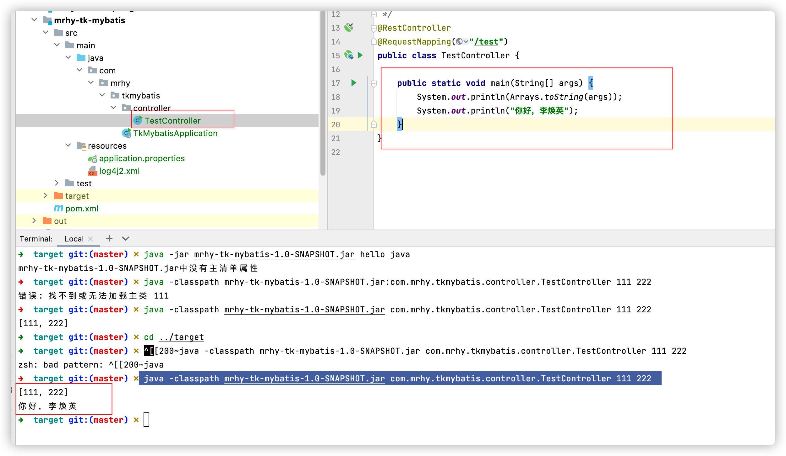

1. spring想要运行jar包里面的main方法

   ```shell
   java -classpath jar包名.jar  包名.类名
   ```

   比如

   ```java
    java -classpath mrhy-tk-mybatis-1.0-SNAPSHOT.jar com.mrhy.tkmybatis.controller.TestController 111 222  
   ```

   

