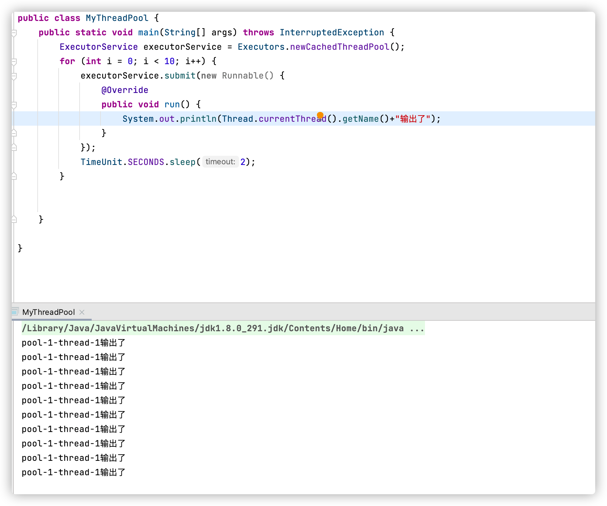
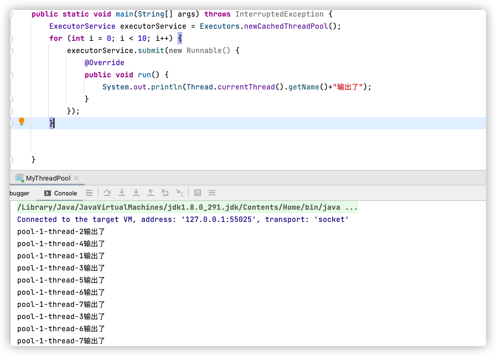
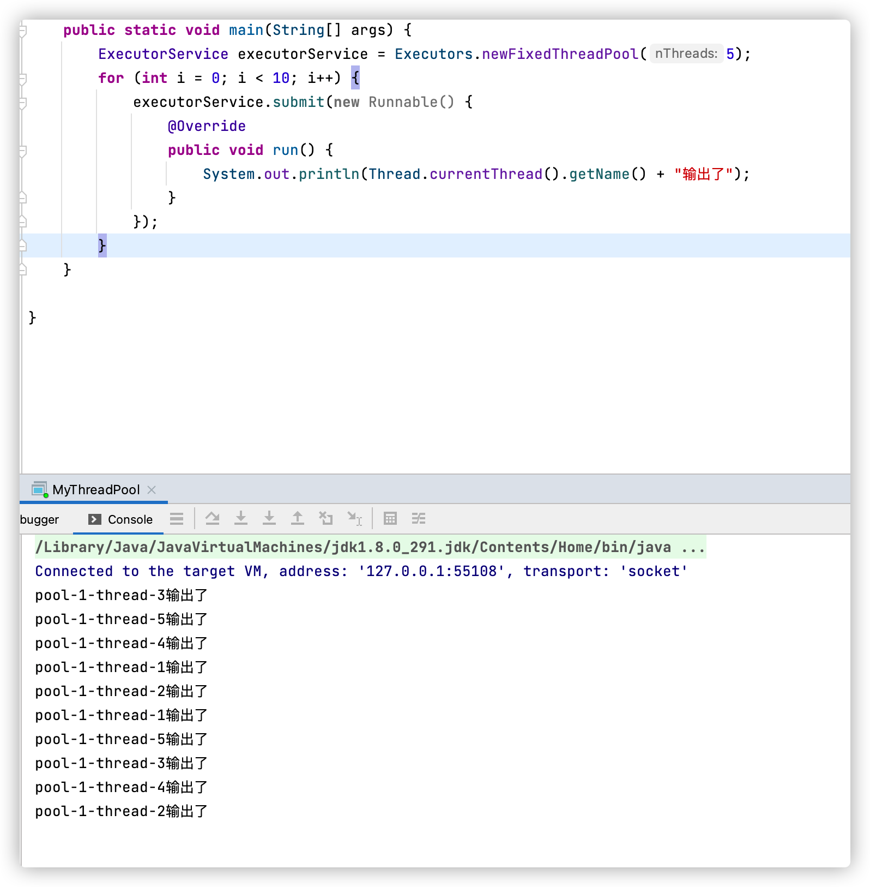
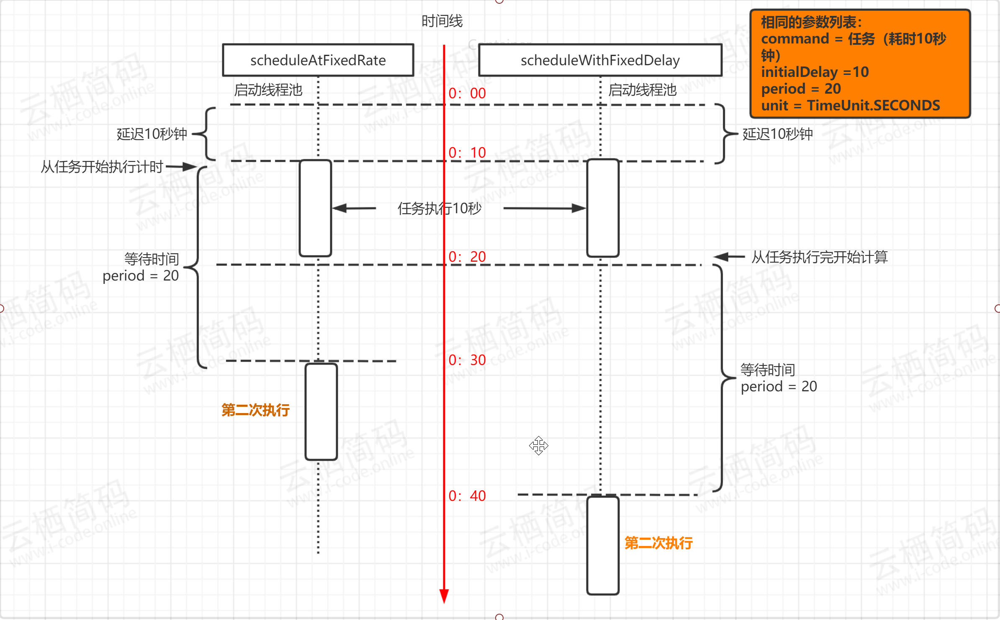

博客搭的好，笔记不能少

<!--more-->

# 线程池的种类

先整理这4种吧

newCachedThreadPool创建一个可缓存线程池，如果线程池长度超过处理需要，可灵活回收空闲线程，若无可回收，则新建线程。
newFixedThreadPool 创建一个定长线程池，可控制线程最大并发数，超出的线程会在队列中等待。
newScheduledThreadPool 创建一个定长线程池，支持定时及周期性任务执行。
newSingleThreadExecutor 创建一个单线程化的线程池，它只会用唯一的工作线程来执行任务，保证所有任务按照指定顺序(FIFO, LILO)执行。

## newCachedThreadPool

工作线程的创建数量几乎没有限制(其实也有限制的,数目为Interger. MAX_VALUE), 这样可灵活的往线程池中添加线程。

如果长时间没有往线程池中提交任务，即如果工作线程空闲了指定的时间(默认为1分钟)，则该工作线程将自动终止。终止后，如果你又提交了新的任务，则线程池重新创建一个工作线程。

在使用CachedThreadPool时，一定要注意控制任务的数量，否则，由于大量线程同时运行，很有会造成系统OOM。

- 有着时间间隔的提交

```java
public static void main(String[] args) throws InterruptedException {
        ExecutorService executorService = Executors.newCachedThreadPool();
        for (int i = 0; i < 10; i++) {
            executorService.submit(new Runnable() {
                @Override
                public void run() {
                    System.out.println(Thread.currentThread().getName()+"输出了");
                }
            });
            TimeUnit.SECONDS.sleep(2);
        }


    }
```



- 无时间间隔的提交

  

  通过对比发现，newCachedThreadPool会在短时间内创建大量的线程。这也是他的弊端

## newFixedThreadPool

创建定长的线程池，最大的线程数量可以通过参数指定

```java
ExecutorService executorService = Executors.newFixedThreadPool(5);
```



通过代码发现，与缓存线程池相比，定长线程池在短时间内不会创建大量的线程。

## newScheduledThreadPool

定时线程池，从源码角度看，他实际上也是一个普通的线程池，但是他的阻塞队列和别的线程池不同

①

```java
  public static ScheduledExecutorService newScheduledThreadPool(int corePoolSize) {
        return new ScheduledThreadPoolExecutor(corePoolSize);
    }
```
②


```java
    public ScheduledThreadPoolExecutor(int corePoolSize) {
        super(corePoolSize, Integer.MAX_VALUE, 0, NANOSECONDS,
              new DelayedWorkQueue());
    }
```

③点击super

```java
   public ThreadPoolExecutor(int corePoolSize,
                              int maximumPoolSize,
                              long keepAliveTime,
                              TimeUnit unit,
                              BlockingQueue<Runnable> workQueue) {
        this(corePoolSize, maximumPoolSize, keepAliveTime, unit, workQueue,
             Executors.defaultThreadFactory(), defaultHandler);
    }
```

来到了线程7板斧，后面的就不细说

那我们研究一下DelayWorkQueue

参考：https://blog.csdn.net/nobody_1/article/details/99684009

- 延迟N秒执行

```java
   public static void main(String[] args) {
        ScheduledExecutorService executorService = Executors.newScheduledThreadPool(5);
        executorService.schedule(new Runnable() {
            @Override
            public void run() {
                System.out.println(Thread.currentThread().getName() + "输出了");
            }
        }, 5, TimeUnit.SECONDS);
        executorService.shutdown();
    }
```

- 按照固定频率执行

  ```java
     public static void main(String[] args) {
          ScheduledExecutorService executorService = Executors.newScheduledThreadPool(5);
          executorService.scheduleAtFixedRate(new Runnable() {
              @Override
              public void run() {
                  System.out.println(Thread.currentThread().getName() + "输出了");
              }
          }, 5, 2,TimeUnit.SECONDS);
      }
  ```

  延迟5秒，然后按照2秒1次执行

- 按照固定频率执行2

  ```java
     public static void main(String[] args) {
          ScheduledExecutorService executorService = Executors.newScheduledThreadPool(5);
          executorService.scheduleWithFixedDelay(new Runnable() {
              @Override
              public void run() {
                  System.out.println(Thread.currentThread().getName() + "输出了");
              }
          }, 5, 2,TimeUnit.SECONDS);
      }
  ```

  scheduleAtFixedRate与scheduleWithFixedDelay的区别是，延时时间计算的方式不同

  `scheduleAtFixedRate` 是以任务开始的时间为时间起点来计时，时间到就执行第二次任务，与任务执行所花费的时间无关；而 `scheduleWithFixedDelay` 是以任务执行结束的时间点作为计时的开始。如下所示

  

图片来源：https://www.cnblogs.com/i-code/p/13917733.html

## newSingleThreadExecutor

创建一个单一线程的线程池，保障fifo

```java
 public static void main(String[] args) {
        ExecutorService executorService = Executors.newSingleThreadExecutor();
        executorService.submit(new Runnable() {
            @Override
            public void run() {
                System.out.println(Thread.currentThread().getName() + "输出了");
            }
        });
    }
```

# 线程池的7大参数

```java
  public ThreadPoolExecutor(int corePoolSize,
                              int maximumPoolSize,
                              long keepAliveTime,
                              TimeUnit unit,
                              BlockingQueue<Runnable> workQueue,
                              ThreadFactory threadFactory,
                              RejectedExecutionHandler handler) {
        if (corePoolSize < 0 ||
            maximumPoolSize <= 0 ||
            maximumPoolSize < corePoolSize ||
            keepAliveTime < 0)
            throw new IllegalArgumentException();
        if (workQueue == null || threadFactory == null || handler == null)
            throw new NullPointerException();
        this.acc = System.getSecurityManager() == null ?
                null :
                AccessController.getContext();
        this.corePoolSize = corePoolSize;
        this.maximumPoolSize = maximumPoolSize;
        this.workQueue = workQueue;
        this.keepAliveTime = unit.toNanos(keepAliveTime);
        this.threadFactory = threadFactory;
        this.handler = handler;
    }
```

corePoolSize:核心线程数

maximumPoolSize：最大线程数

keepAliveTime：存活时间 keepAliveTime是线程池中空闲线程等待工作的超时时间。
当线程池中线程数量大于corePoolSize（核心线程数量）或设置了allowCoreThreadTimeOut（是否允许空闲核心线程超时）时，线程会根据keepAliveTime的值进行活性检查，一旦超时便销毁线程。

unit：单位

workQueue：队列

threadFactory：线程工厂，在里面可以自定义线程名字

handler：拒绝策略

# 线程池的4种拒绝策略

AbortPolicy：丢弃任务，抛出RejectedExecutionHandler异常

DiscardPolicy：丢弃，但不抛出异常

DiscardOldestPolicy：丢弃一个最老的

CallerRunsPolicy：在主线程开启一个线程，执行方法
