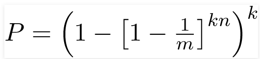
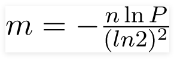
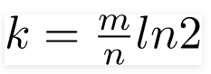

今天学习一下布隆过滤器的知识点，之前没有形成统一的笔记，今天特此记录一下。

<!-- more-->

# 布隆过滤器是什么

**布隆过滤器**（英语：Bloom Filter）是1970年由布隆提出的。它实际上是一个很长的[二进制](https://zh.wikipedia.org/wiki/二进制)向量和一系列随机[映射函数](https://zh.wikipedia.org/wiki/映射)。布隆过滤器可以用于检索一个元素是否在一个集合中。它的优点是空间效率和查询时间都远远超过一般的算法，缺点是有一定的误识别率和删除困难

如果想判断一个元素是不是在一个集合里，一般想到的是将集合中所有元素保存起来，然后通过比较确定。[链表](https://zh.wikipedia.org/wiki/链表)、[树](https://zh.wikipedia.org/wiki/树_(数据结构))、[散列表](https://zh.wikipedia.org/wiki/散列表)（又叫哈希表，Hash table）等等数据结构都是这种思路。但是随着集合中元素的增加，我们需要的存储空间越来越大。同时检索速度也越来越慢，上述三种结构的检索时间复杂度分别为 O(n),O(\log n),O(1)

布隆过滤器的原理是，当一个元素被加入集合时，通过K个[散列函数](https://zh.wikipedia.org/wiki/散列函数)将这个元素映射成一个位[数组](https://zh.wikipedia.org/wiki/数组)中的K个点，把它们置为1。检索时，我们只要看看这些点是不是都是1就（大约）知道集合中有没有它了：如果这些点有任何一个0，则被检元素一定不在；如果都是1，则被检元素很可能在。这就是布隆过滤器的基本思想。

# 优点

相比于其它的数据结构，布隆过滤器在空间和时间方面都有巨大的优势。布隆过滤器存储空间和插入/查询时间都是常数O(K)。另外，散列函数相互之间没有关系，方便由硬件并行实现。布隆过滤器不需要存储元素本身，在某些对保密要求非常严格的场合有优势。

布隆过滤器可以表示全集，其它任何数据结构都不能；k和m相同，使用同一组散列函数的两个布隆过滤器的交并[[来源请求\]](https://zh.wikipedia.org/wiki/Wikipedia:列明来源)运算可以使用位操作进行。

# 缺点

但是布隆过滤器的缺点和优点一样明显。误算率是其中之一。随着存入的元素数量增加，误算率随之增加。但是如果元素数量太少，则使用散列表足矣。

另外，一般情况下不能从布隆过滤器中删除元素。我们很容易想到把位数组变成整数数组，每插入一个元素相应的计数器加1, 这样删除元素时将计数器减掉就可以了。然而要保证安全地删除元素并非如此简单。首先我们必须保证删除的元素的确在布隆过滤器里面。这一点单凭这个过滤器是无法保证的。另外计数器回绕也会造成问题。

在降低误算率方面，有不少工作，使得出现了很多布隆过滤器的变种。

# 布隆过滤器公式

**布隆过滤器的误报概率**
假设数组长度为m,并使用k个hash函数，n是要插入到过滤器中的元素个数，那么误报率的计算如下：

**位数组的大小**

如果过滤器中的元素数量已知，期望的误报率位p，那么二进制位数组大小计算公式如下：

**最优哈希函数数量**
如果m是数组长度，n是插入的元素个数，k是hash函数的个数，k计算公式如下：


**哈希函数的选择**
哈希函数独立且生成的数值均匀分布，并且尽可能的快。比如MurmurHash、Jenkins_hash_function。

# java集成布隆过滤器

```pom
   <dependency>
            <groupId>com.google.guava</groupId>
            <artifactId>guava</artifactId>
            <version>31.1-jre</version>
        </dependency>
```

咱们采用guava工具包中的bloom过滤器

**创建布隆过滤器**

```java
BloomFilter<Integer> bloomFilter=BloomFilter.create(Funnels.integerFunnel(), 1_000_000,0.01);
```

创建布隆过滤器时要传入期望处理的元素数量，及最期望的误报的概率。如上分别是1_000_000和0.01。

**放置元素**

```java
bloomFilter.put(1);
bloomFilter.put(2);
```

**判断元素是否存在**

```java
```

