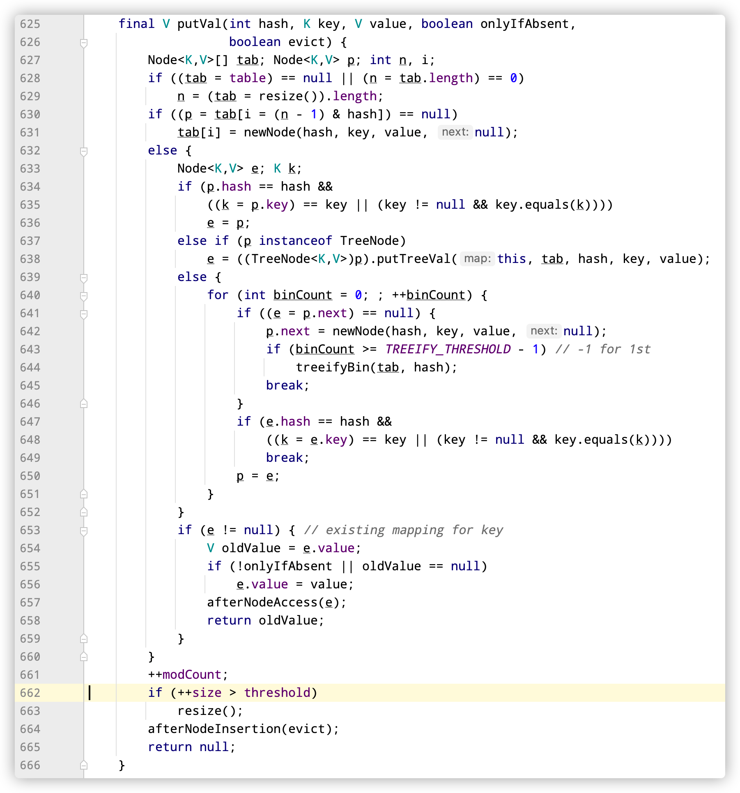
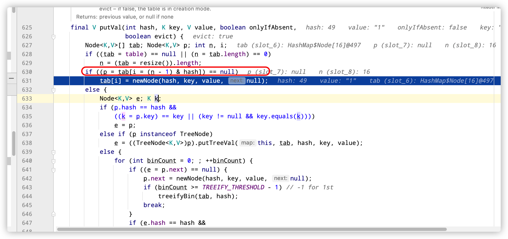

抽时间静下心来读一下hashMap的源码，从大佬前辈们的代码中获取灵感，充实自己。gogogo 

<!-- more-->

# HashMap 初始化

通常我们用hashMap的时候会new一个hashMap的对象，那new的过程中发生了什么呢

```java
// 初始化
  HashMap<String, String> stringStringHashMap = new HashMap<>();
```

走起，点击进来

```java
 		/**
     * Constructs an empty <tt>HashMap</tt> with the default initial capacity
     * (16) and the default load factor (0.75).
     */
    public HashMap() {
        this.loadFactor = DEFAULT_LOAD_FACTOR; // all other fields defaulted
    }
```

如上所示，HashMap的无参构造方法就只有一行，默认加载因子为0.75，此处没有指定默认的容量，我们往上翻常量

```java
		/**
     * The default initial capacity - MUST be a power of two.
     */
    static final int DEFAULT_INITIAL_CAPACITY = 1 << 4; // aka 16

    /**
     * The maximum capacity, used if a higher value is implicitly specified
     * by either of the constructors with arguments.
     * MUST be a power of two <= 1<<30.
     */
    static final int MAXIMUM_CAPACITY = 1 << 30;

    /**
     * The load factor used when none specified in constructor.
     */
    static final float DEFAULT_LOAD_FACTOR = 0.75f;

    /**
     * The bin count threshold for using a tree rather than list for a
     * bin.  Bins are converted to trees when adding an element to a
     * bin with at least this many nodes. The value must be greater
     * than 2 and should be at least 8 to mesh with assumptions in
     * tree removal about conversion back to plain bins upon
     * shrinkage.
     */
    static final int TREEIFY_THRESHOLD = 8;

    /**
     * The bin count threshold for untreeifying a (split) bin during a
     * resize operation. Should be less than TREEIFY_THRESHOLD, and at
     * most 6 to mesh with shrinkage detection under removal.
     */
    static final int UNTREEIFY_THRESHOLD = 6;

    /**
     * The smallest table capacity for which bins may be treeified.
     * (Otherwise the table is resized if too many nodes in a bin.)
     * Should be at least 4 * TREEIFY_THRESHOLD to avoid conflicts
     * between resizing and treeification thresholds.
     */
    static final int MIN_TREEIFY_CAPACITY = 64;

```

可以看到 默认初始容量为16 ，再理解一下其他参数

```java
// 最大容量  
static final int MAXIMUM_CAPACITY = 1 << 30;
// 默认加载因子
static final float DEFAULT_LOAD_FACTOR = 0.75f;
// 链表转为红黑树的临界值
static final int TREEIFY_THRESHOLD = 8;
// 红黑树再次转为链表的临界值
static final int UNTREEIFY_THRESHOLD = 6;
// 链表转换为红黑树的最小数组的长度，如果不够这个长度则扩容 
static final int MIN_TREEIFY_CAPACITY = 64;
```

从上面  我们再引出一个面试中常问的问题

# HashMap的默认初始化加载因子的作用

```java
//默认加载因子是threadhold 的决定因素之一，而threadhold是HashMap的table 进行扩容的临界点，举个简单的例子,如果table 初始容量大小为是16，加载因子为0.75，则当数组长度为16*0.75=12的时候，然后下一个put的时候将进行扩容操作。关键代码如下：662-663
```



# HashMap默认加载因子为什么是0.75

**加载因子**是表示Hsah表中元素的填满的程度。

加载因子越大,填满的元素越多,空间利用率越高，但冲突的机会加大了。

反之,加载因子越小,填满的元素越少,冲突的机会减小,但空间浪费多了。

冲突的机会越大,则查找的成本越高。反之,查找的成本越小。

因此,必须在 "冲突的机会"与"空间利用率"之间寻找一种平衡与折衷。

```java
 /*   Because TreeNodes are about twice the size of regular nodes, we
     * use them only when bins contain enough nodes to warrant use
     * (see TREEIFY_THRESHOLD). And when they become too small (due to
     * removal or resizing) they are converted back to plain bins.  In
     * usages with well-distributed user hashCodes, tree bins are
     * rarely used.  Ideally, under random hashCodes, the frequency of
     * nodes in bins follows a Poisson distribution
     * (http://en.wikipedia.org/wiki/Poisson_distribution) with a
     * parameter of about 0.5 on average for the default resizing
     * threshold of 0.75, although with a large variance because of
     * resizing granularity. Ignoring variance, the expected
     * occurrences of list size k are (exp(-0.5) * pow(0.5, k) /
     * factorial(k)). The first values are:
     *
     * 0:    0.60653066
     * 1:    0.30326533
     * 2:    0.07581633
     * 3:    0.01263606
     * 4:    0.00157952
     * 5:    0.00015795
     * 6:    0.00001316
     * 7:    0.00000094
     * 8:    0.00000006
     * more: less than 1 in ten million
     *
```


简单翻译一下就是在理想情况下,使用随机哈希码,节点出现的频率在hash桶中遵循泊松分布，同时给出了桶中元素个数和概率的对照表。

从上面的表中可以看到当桶中元素到达8个的时候，概率已经变得非常小，也就是说用0.75作为加载因子，每个碰撞位置的链表长度超过８个是几乎不可能的。

# HashMap中hash函数的实现过程

贴一段String中hash函数实现

```java
  public int hashCode() {
        int h = hash;
        if (h == 0 && value.length > 0) {
            char val[] = value;

            for (int i = 0; i < value.length; i++) {
                h = 31 * h + val[i];
            }
            hash = h;
        }
        return h;
    }
```

将string 转为char数组，取元素在ASCII码中的位置相加，然后依次进行遍历加和（描述不是很准确，看代码吧）

我们在看一下hashMap中的函数，还是以放入的key为String类型为例。代码如下

```java
static final int hash(Object key) {
    int h;
    return (key == null) ? 0 : (h = key.hashCode()) ^ (h >>> 16);
}
```

在原有的基础上，对重新对hash进行优化，得出的hashCode 的低16位与高16位进行==异或==

> 异或

 异域的概念是相同为0不同为1.如果两个数值异或后的值相同，异或前可能不同。 
比如二进制：0010^0001=0011 而0000^0011=0011。

> 异或的注意点

1.自己与自己异或结果为0，

2.异或满足 交换律。a^b=b^a，即异或满足交换律。

> hashMap 中获取hash值异或的好处是什么

保证低16位与高16位只要有一位进行变动，就会对hash值产生影响，减少了hash冲突的可能性。

# hashMap中put方法分析

当我们输入如下代码，跟着断点看hashMap到底进行了如何操作

```java
        HashMap<String, String> stringStringHashMap = new HashMap<>();
        stringStringHashMap.put("1","1");
```

一步一步走

```java
 public V put(K key, V value) {
        return putVal(hash(key), key, value, false, true);
    }
// 此处计算key的hash值，上面已经分析过了，不再过多赘述
```

看putVal方法

```java
    final V putVal(int hash, K key, V value, boolean onlyIfAbsent,
                   boolean evict) {
        Node<K,V>[] tab; Node<K,V> p; int n, i;
        if ((tab = table) == null || (n = tab.length) == 0)
          // 第一次放入元素的时候，就会进入此分支，进行resize操作。
            n = (tab = resize()).length;
        if ((p = tab[i = (n - 1) & hash]) == null)
          // 判断 （当前容器的大小为 -1）与 hashCode相与，判断当前位置是否有元素。
          // 引出一个知识点，为什么hashMap的容量一定要设置成2的倍数。
            tab[i] = newNode(hash, key, value, null);
        else {
            Node<K,V> e; K k;
            if (p.hash == hash &&
                ((k = p.key) == key || (key != null && key.equals(k))))
                e = p;
            else if (p instanceof TreeNode)
                e = ((TreeNode<K,V>)p).putTreeVal(this, tab, hash, key, value);
            else {
                for (int binCount = 0; ; ++binCount) {
                    if ((e = p.next) == null) {
                        p.next = newNode(hash, key, value, null);
                        if (binCount >= TREEIFY_THRESHOLD - 1) // -1 for 1st
                            treeifyBin(tab, hash);
                        break;
                    }
                    if (e.hash == hash &&
                        ((k = e.key) == key || (key != null && key.equals(k))))
                        break;
                    p = e;
                }
            }
            if (e != null) { // existing mapping for key
                V oldValue = e.value;
                if (!onlyIfAbsent || oldValue == null)
                    e.value = value;
                afterNodeAccess(e);
                return oldValue;
            }
        }
        ++modCount;
        if (++size > threshold)
            resize();
        afterNodeInsertion(evict);
        return null;
    }
```

当我们放入第一个元素时， 因为table为null，所以走第一个if分支，进行resize()操作进行扩容。

```java
   final Node<K,V>[] resize() {
        Node<K,V>[] oldTab = table;
     // 第一次放入 oldCap为0
        int oldCap = (oldTab == null) ? 0 : oldTab.length;
     // oldThr 也为0；
        int oldThr = threshold;
        int newCap, newThr = 0;
        if (oldCap > 0) {
            if (oldCap >= MAXIMUM_CAPACITY) {
                threshold = Integer.MAX_VALUE;
                return oldTab;
            }
            else if ((newCap = oldCap << 1) < MAXIMUM_CAPACITY &&
                     oldCap >= DEFAULT_INITIAL_CAPACITY)
                newThr = oldThr << 1; // double threshold
        }
        else if (oldThr > 0) // initial capacity was placed in threshold
            newCap = oldThr;
        else {               // zero initial threshold signifies using defaults
          // 第一次放入走else 这个分支，将容量和扩容临界值变为默认值  16 和12
            newCap = DEFAULT_INITIAL_CAPACITY;
            newThr = (int)(DEFAULT_LOAD_FACTOR * DEFAULT_INITIAL_CAPACITY);
        }
        if (newThr == 0) {
            float ft = (float)newCap * loadFactor;
            newThr = (newCap < MAXIMUM_CAPACITY && ft < (float)MAXIMUM_CAPACITY ?
                      (int)ft : Integer.MAX_VALUE);
        }
        threshold = newThr;
        @SuppressWarnings({"rawtypes","unchecked"})
     // 第一次初始化 newCap为16，此处创建一个新的数组结构
        Node<K,V>[] newTab = (Node<K,V>[])new Node[newCap];
        table = newTab;
     // 第一次初始化oldTab为null，此时直接返回newTable
        if (oldTab != null) {
            for (int j = 0; j < oldCap; ++j) {
                Node<K,V> e;
                if ((e = oldTab[j]) != null) {
                    oldTab[j] = null;
                    if (e.next == null)
                        newTab[e.hash & (newCap - 1)] = e;
                    else if (e instanceof TreeNode)
                        ((TreeNode<K,V>)e).split(this, newTab, j, oldCap);
                    else { // preserve order
                        Node<K,V> loHead = null, loTail = null;
                        Node<K,V> hiHead = null, hiTail = null;
                        Node<K,V> next;
                        do {
                            next = e.next;
                            if ((e.hash & oldCap) == 0) {
                                if (loTail == null)
                                    loHead = e;
                                else
                                    loTail.next = e;
                                loTail = e;
                            }
                            else {
                                if (hiTail == null)
                                    hiHead = e;
                                else
                                    hiTail.next = e;
                                hiTail = e;
                            }
                        } while ((e = next) != null);
                        if (loTail != null) {
                            loTail.next = null;
                            newTab[j] = loHead;
                        }
                        if (hiTail != null) {
                            hiTail.next = null;
                            newTab[j + oldCap] = hiHead;
                        }
                    }
                }
            }
        }
        return newTab;
    }
```

紧接着我们放入第二个元素,还是看putVal方法

```java
 final V putVal(int hash, K key, V value, boolean onlyIfAbsent,
                   boolean evict) {
        Node<K,V>[] tab; Node<K,V> p; int n, i;
   // 此时不为空，则不走这个if
        if ((tab = table) == null || (n = tab.length) == 0)
            n = (tab = resize()).length;
   // 如果不同，则 tab【i】的位置放入一个新的node节点
        if ((p = tab[i = (n - 1) & hash]) == null)
            tab[i] = newNode(hash, key, value, null);
        else {
          // 如果新放入的key与之前某个位置的key产生了冲突
            Node<K,V> e; K k;
          // 判断当前的hash值是否和心如的一样，并且key是否和key一样，如果一样则认为是相同的，将p赋值给e 
            if (p.hash == hash &&
                ((k = p.key) == key || (key != null && key.equals(k))))
                e = p;
            else if (p instanceof TreeNode)
              // 否则，查看这个p节点是否是红黑树的类型
                e = ((TreeNode<K,V>)p).putTreeVal(this, tab, hash, key, value);
            else {
              // 如果不是红黑树，则插入
                for (int binCount = 0; ; ++binCount) {
                  // 此处可以看出，下个节点放在p的后面，也就是尾插法
                    if ((e = p.next) == null) {
                        p.next = newNode(hash, key, value, null);
                      // 如果当前节点的数量大于等于要树话的临界值
                        if (binCount >= TREEIFY_THRESHOLD - 1) // -1 for 1st
                            treeifyBin(tab, hash);
                        break;
                    }
                  // 同样去判断是否相等
                    if (e.hash == hash &&
                        ((k = e.key) == key || (key != null && key.equals(k))))
                        break;
                  // 将e 赋值给p
                    p = e;
                }
            }
            if (e != null) { // existing mapping for key
                V oldValue = e.value;
                if (!onlyIfAbsent || oldValue == null)
                    e.value = value;
                afterNodeAccess(e);
                return oldValue;
            }
        }
        ++modCount;
        if (++size > threshold)
            resize();
        afterNodeInsertion(evict);
        return null;
    }
```

# hashMap的容量为什么一定要设置成2的倍数



我们可以看到新元素的位置是由（n-1）&hash码确定的

比如n为15（非2的倍数）减去1 为14  在进行与运算的时候，1110 & hash   hash 如果是 1110 和1111 计算出来的结果是一样的，这样就增大了hash冲突的概率，所以不提倡。如果n是2的倍数则可以很好的避免这种情况。

# hashMap 链表转换为红黑树的实现

```java
final void treeifyBin(Node<K,V>[] tab, int hash) {
        int n, index; Node<K,V> e;
  // 如果tab是null 或者tab数组的长度小于最小树化的时候，这时候不是转换成红黑树，而是扩容
        if (tab == null || (n = tab.length) < MIN_TREEIFY_CAPACITY)
            resize();
        else if ((e = tab[index = (n - 1) & hash]) != null) {
            TreeNode<K,V> hd = null, tl = null;
            do {
              // replacementTreeNode的代码我也贴一下，实际上就是返回一个trueNode节点
                TreeNode<K,V> p = replacementTreeNode(e, null);
                if (tl == null)
                    hd = p;
                else {
                    p.prev = tl;
                    tl.next = p;
                }
                tl = p;
            } while ((e = e.next) != null);
            if ((tab[index] = hd) != null)
                hd.treeify(tab);
        }
    }

   // For treeifyBin
    TreeNode<K,V> replacementTreeNode(Node<K,V> p, Node<K,V> next) {
        return new TreeNode<>(p.hash, p.key, p.value, next);
    }

```

# hashMap 的get方法实现

```java
    public V get(Object key) {
        Node<K,V> e;
        return (e = getNode(hash(key), key)) == null ? null : e.value;
    }
final Node<K,V> getNode(int hash, Object key) {
        Node<K,V>[] tab; Node<K,V> first, e; int n; K k;
  // 如果是数组是空，直接返回null，如果不是则进行如下逻辑
        if ((tab = table) != null && (n = tab.length) > 0 &&
            (first = tab[(n - 1) & hash]) != null) {
          // 如果是首个节点的hash 和 key都是相等的，则返回首个节点
            if (first.hash == hash && // always check first node
                ((k = first.key) == key || (key != null && key.equals(k))))
                return first;
            if ((e = first.next) != null) {
              // 如果不是，并且节点是treeNode类型，则根据红黑树去找
                if (first instanceof TreeNode)
                    return ((TreeNode<K,V>)first).getTreeNode(hash, key);
                do {
                  // 否则遍历链表
                    if (e.hash == hash &&
                        ((k = e.key) == key || (key != null && key.equals(k))))
                        return e;
                } while ((e = e.next) != null);
            }
        }
        return null;
    }
```

# hashMap 的remove方法实现

```java
 public V remove(Object key) {
        Node<K,V> e;
        return (e = removeNode(hash(key), key, null, false, true)) == null ?
            null : e.value;
    }
  final Node<K,V> removeNode(int hash, Object key, Object value,
                               boolean matchValue, boolean movable) {
        Node<K,V>[] tab; Node<K,V> p; int n, index;
        if ((tab = table) != null && (n = tab.length) > 0 &&
            (p = tab[index = (n - 1) & hash]) != null) {
            Node<K,V> node = null, e; K k; V v;
          
          //寻找节点
            if (p.hash == hash &&
                ((k = p.key) == key || (key != null && key.equals(k))))
                node = p;
            else if ((e = p.next) != null) {
                if (p instanceof TreeNode)
                    node = ((TreeNode<K,V>)p).getTreeNode(hash, key);
                else {
                    do {
                        if (e.hash == hash &&
                            ((k = e.key) == key ||
                             (key != null && key.equals(k)))) {
                            node = e;
                            break;
                        }
                        p = e;
                    } while ((e = e.next) != null);
                }
            }
          //找到之后断链
            if (node != null && (!matchValue || (v = node.value) == value ||
                                 (value != null && value.equals(v)))) {
                if (node instanceof TreeNode)
                    ((TreeNode<K,V>)node).removeTreeNode(this, tab, movable);
                else if (node == p)
                    tab[index] = node.next;
                else
                    p.next = node.next;
                ++modCount;
                --size;
                afterNodeRemoval(node);
                return node;
            }
        }
        return null;
    }
```

--未完待续--hashMap树化和非树化的方法
