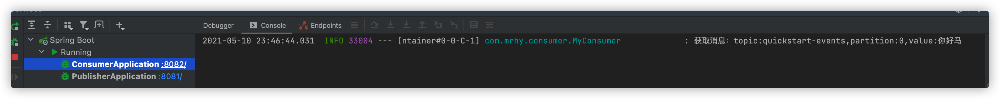

创建一个简单的kafka父子项目，用来熟悉一下kafka在springboot中的集成，特此记录一下

<!--more-->

# 环境

开发工具：idea

开发环境：maven、java1.8

电脑：macOS

# 创建一个父项目，现贴入pom.xml

```xml
<?xml version="1.0" encoding="UTF-8"?>
<project xmlns="http://maven.apache.org/POM/4.0.0"
         xmlns:xsi="http://www.w3.org/2001/XMLSchema-instance"
         xsi:schemaLocation="http://maven.apache.org/POM/4.0.0 http://maven.apache.org/xsd/maven-4.0.0.xsd">
    <modelVersion>4.0.0</modelVersion>

    <groupId>com.mrhy</groupId>
    <artifactId>kafka-demo</artifactId>
    <packaging>pom</packaging>
    <version>1.0-SNAPSHOT</version>
    <modules>
        <module>kafka-publisher</module>
        <module>kafka-consumer</module>
    </modules>

    <properties>
        <java.version>1.8</java.version>
        <maven.compiler.source>8</maven.compiler.source>
        <maven.compiler.target>8</maven.compiler.target>
        <spring-boot.version>2.4.5</spring-boot.version>
        <lombok.version>1.18.20</lombok.version>
    </properties>


    <dependencyManagement>
        <dependencies>
            <dependency>
                <groupId>org.springframework.boot</groupId>
                <artifactId>spring-boot-dependencies</artifactId>
                <version>${spring-boot.version}</version>
            </dependency>
            <dependency>
                <groupId>org.projectlombok</groupId>
                <artifactId>lombok</artifactId>
                <version>${lombok.version}</version>
            </dependency>
            <!-- https://mvnrepository.com/artifact/org.apache.kafka/kafka-clients -->
<!--            <dependency>-->
<!--                <groupId>org.apache.kafka</groupId>-->
<!--                <artifactId>kafka-clients</artifactId>-->
<!--                <version>${kafka-client.version}</version>-->
<!--            </dependency>-->


        </dependencies>
    </dependencyManagement>
    <build>
        <plugins>
            <plugin>
                <groupId>org.springframework.boot</groupId>
                <artifactId>spring-boot-maven-plugin</artifactId>
                <configuration>
                    <excludes>
                        <exclude>
                            <groupId>org.projectlombok</groupId>
                            <artifactId>lombok</artifactId>
                        </exclude>
                    </excludes>
                </configuration>
            </plugin>
        </plugins>
    </build>


</project>
```

# 创建生产者

## pom.xml如下

```xml
<?xml version="1.0" encoding="UTF-8"?>
<project xmlns="http://maven.apache.org/POM/4.0.0"
         xmlns:xsi="http://www.w3.org/2001/XMLSchema-instance"
         xsi:schemaLocation="http://maven.apache.org/POM/4.0.0 http://maven.apache.org/xsd/maven-4.0.0.xsd">
    <parent>
        <artifactId>kafka-demo</artifactId>
        <groupId>com.mrhy</groupId>
        <version>1.0-SNAPSHOT</version>
    </parent>
    <modelVersion>4.0.0</modelVersion>

    <artifactId>kafka-publisher</artifactId>

    <properties>
        <maven.compiler.source>8</maven.compiler.source>
        <maven.compiler.target>8</maven.compiler.target>
    </properties>
    <dependencies>
        <dependency>
            <groupId>org.springframework.boot</groupId>
            <artifactId>spring-boot-starter-web</artifactId>
        </dependency>
        <dependency>
            <groupId>org.projectlombok</groupId>
            <artifactId>lombok</artifactId>
        </dependency>
        <dependency>
            <groupId>org.springframework.kafka</groupId>
            <artifactId>spring-kafka</artifactId>
        </dependency>
<!--        <dependency>-->
<!--            <groupId>org.apache.kafka</groupId>-->
<!--            <artifactId>kafka-clients</artifactId>-->
<!--        </dependency>-->
        <dependency>
            <groupId>org.springframework.boot</groupId>
            <artifactId>spring-boot-starter-test</artifactId>
            <scope>test</scope>
        </dependency>
    </dependencies>

</project>
```

## 配置application.properties

```properties
server.port=8081

server.servlet.context-path=/publisher

spring.kafka.bootstrap-servers=localhost:9092

# 发生错误时，消息重发的次数
spring.kafka.producer.retries=0
#当有多个消息需要被发送到同一个分区时，生产者会把它们放在同一个批次里。该参数指定了一个批次可以使用的内存大小，按照字节数计算。
spring.kafka.producer.batch-size=16384
# 设置生产者内存缓冲区大小
spring.kafka.producer.buffer-memory=33554432
# key的序列化方式
spring.kafka.producer.key-serializer=org.apache.kafka.common.serialization.StringSerializer
# 值得序列化方式
spring.kafka.producer.value-serializer=org.apache.kafka.common.serialization.StringSerializer
# acks=0 ： 生产者在成功写入消息之前不会等待任何来自服务器的响应。
# acks=1 ： 只要集群的首领节点收到消息，生产者就会收到一个来自服务器成功响应。
# acks=all ：只有当所有参与复制的节点全部收到消息时，生产者才会收到一个来自服务器的成功响应。
spring.kafka.producer.acks=1
```

## 生产者发送消息

```java
@Component
@Log4j2
public class MyProvider {
    @Autowired
    KafkaTemplate kafkaTemplate;


    public void sendMessage(String topic, Object object) {
        /*
         * 这里的 ListenableFuture 类是 spring 对 java 原生 Future 的扩展增强,是一个泛型接口,用于监听异步方法的回调
         * 而对于 kafka send 方法返回值而言，这里的泛型所代表的实际类型就是 SendResult<K, V>,而这里 K,V 的泛型实际上
         * 被用于 ProducerRecord<K, V> producerRecord,即生产者发送消息的 key,value 类型
         */
        ListenableFuture<SendResult<String, Object>> future = kafkaTemplate.send(topic, object);

        future.addCallback(new ListenableFutureCallback<SendResult<String, Object>>() {
            @Override
            public void onFailure(Throwable throwable) {
                log.info("发送消息失败:" + throwable.getMessage());
            }

            @Override
            public void onSuccess(SendResult<String, Object> sendResult) {
                System.out.println("发送结果:" + sendResult.toString());
            }
        });
    }
}

```

## 创建测试类

```java
@SpringBootTest(classes = PublisherApplication.class)
@RunWith(SpringRunner.class)
public class SendTest {
    @Autowired
    MyProvider myProvider;
    @Test
    public void testSendMsg(){
        myProvider.sendMessage("quickstart-events","你好");
    }
}
```

# 消费者消费指定topic的消息

## pom.xml

```xml
<?xml version="1.0" encoding="UTF-8"?>
<project xmlns="http://maven.apache.org/POM/4.0.0"
         xmlns:xsi="http://www.w3.org/2001/XMLSchema-instance"
         xsi:schemaLocation="http://maven.apache.org/POM/4.0.0 http://maven.apache.org/xsd/maven-4.0.0.xsd">
    <parent>
        <artifactId>kafka-demo</artifactId>
        <groupId>com.mrhy</groupId>
        <version>1.0-SNAPSHOT</version>
    </parent>
    <modelVersion>4.0.0</modelVersion>

    <artifactId>kafka-consumer</artifactId>

    <properties>
        <maven.compiler.source>8</maven.compiler.source>
        <maven.compiler.target>8</maven.compiler.target>
    </properties>
    <dependencies>
        <dependency>
            <groupId>org.springframework.boot</groupId>
            <artifactId>spring-boot-starter-web</artifactId>
        </dependency>

        <dependency>
            <groupId>org.projectlombok</groupId>
            <artifactId>lombok</artifactId>
        </dependency>
        <dependency>
            <groupId>org.springframework.kafka</groupId>
            <artifactId>spring-kafka</artifactId>
        </dependency>
    </dependencies>
</project>
```

## 配置application.properties

```properties
server.port=8082

server.servlet.context-path=/consumer

spring.kafka.bootstrap-servers=localhost:9092

# 自动提交的时间间隔 在 spring boot 2.X 版本中这里采用的是值的类型为 Duration 需要符合特定的格式，如 1S,1M,2H,5D
spring.kafka.consumer.auto-commit-interval=1S

spring.kafka.consumer.auto-offset-reset=earliest

spring.kafka.consumer.enable-auto-commit=true

spring.kafka.consumer.key-deserializer=org.apache.kafka.common.serialization.StringDeserializer
spring.kafka.consumer.value-deserializer=org.apache.kafka.common.serialization.StringDeserializer


spring.kafka.listener.concurrency=5
```

## 消费者消费

```java
@Component
@Log4j2
public class MyConsumer {

    @KafkaListener(topics = {"quickstart-events"},groupId = "defaultConsumerGroup")
    public void getMsg(ConsumerRecord<?, ?> record){
        log.info("获取消息：topic:{},partition:{},value:{}",record.topic(),record.partition(),record.value());
    }
}
```

点击并打开消费者项目，此时消费者就进入监听状态，当我们执行生产者的sendMsg的测试方法的时候，可以看到消费者就会有一条消息消费



结束，收工。