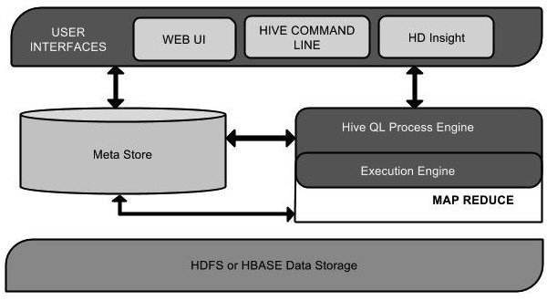

hive是基于Hadoop的一个数据仓库工具，用来进行数据提取、转化、加载，这是一种可以存储、查询和分析存储在Hadoop中的大规模数据的机制。hive数据仓库工具能将结构化的数据文件映射为一张数据库表，并提供SQL查询功能，能将SQL语句转变成MapReduce任务来执行。Hive的优点是学习成本低，可以通过类似SQL语句实现快速MapReduce统计，使MapReduce变得更加简单，而不必开发专门的MapReduce应用程序。hive十分适合对数据仓库进行统计分析。
<!--more-->

# hive 的特点

- 它存储架构在一个数据库中并处理数据到HDFS。

- 它是专为OLAP设计。

- 它提供SQL类型语言查询叫HiveQL或HQL。

- 它是熟知，快速，可扩展和可扩展的

# hive的架构

| 单元名称                      | 操作                                                         |
| ----------------------------- | ------------------------------------------------------------ |
| 用户接口/界面 User InterFaces | Hive是一个数据仓库基础工具软件，可以创建用户和HDFS之间互动。用户界面，Hive支持是Hive的Web UI，Hive命令行，HiveHD洞察（在Windows服务器）。 |
| Meta Store 元存储             | Hive选择各自的数据库服务器，用以储存表，数据库，列模式或元数据表，它们的数据类型和HDFS映射。 |
| HiveQL处理引擎                | HiveQL类似于SQL的查询上Metastore模式信息。这是传统的方式进行MapReduce程序的替代品之一。相反，使用Java编写的MapReduce程序，可以编写为MapReduce工作，并处理它的查询。 |
| 执行引擎                      | HiveQL处理引擎和MapReduce的结合部分是由Hive执行引擎。执行引擎处理查询并产生结果和MapReduce的结果一样。它采用MapReduce方法 |
| HDFS或者HBASE 数据存储        | Hadoop的分布式文件系统或者HBASE数据存储技术是用于将数据存储到文件系统。 |

# hive的安装（mac版本）
> 环境

操作系统：macOS Big Sur 
版本：11.2.3

