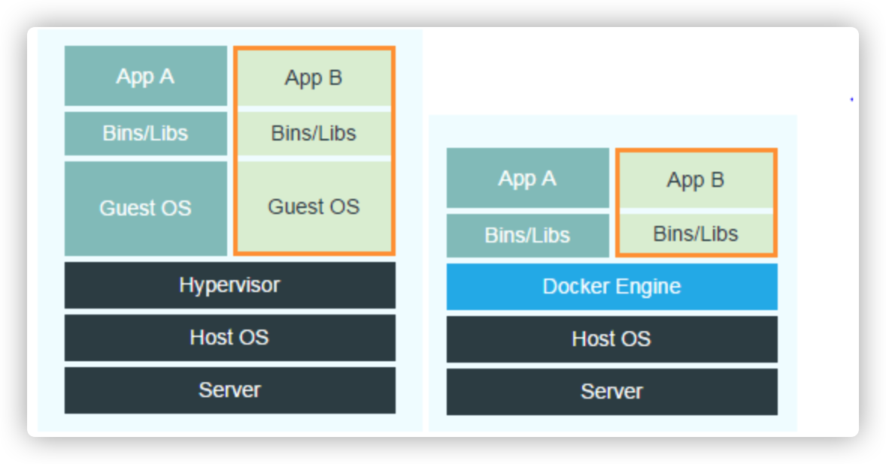
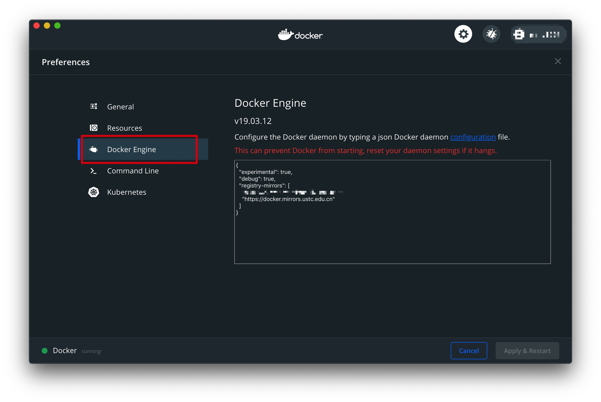
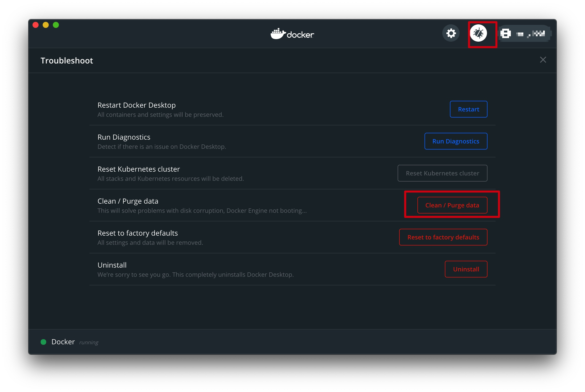

## 什么是docker

Docker 是一个开源的应用容器引擎，基于 Go 语言并遵从 Apache2.0 协议开源。

Docker 可以让开发者打包他们的应用以及依赖包到一个轻量级、可移植的容器中，然后发布到任何流行的 Linux 机器上，也可以实现虚拟化。

容器是完全使用沙箱机制，相互之间不会有任何接口（类似 iPhone 的 app）,更重要的是容器性能开销极低。

<!--more-->

## docker与传统的虚拟机有什么区别



vm与docker框架，直观上来讲**vm多了一层guest OS，同时Hypervisor会对硬件资源进行虚拟化，docker直接使用硬件资源**，所以资源利用率相对docker低也是比较容易理解的

## docker的安装与常见问题

### 环境

* 操作系统：macos 10.15.6
* 窗口：iTerm2
* 工具包：homebrew


### 安装

1. 打开iterm窗口

2. 输入命令

   ```shell
   brew cask install docker
   ```

3. 等待docker安装完成

4. docker安装完成之后在启动台中会有docker启动项
   

5. 打开docker，第一启动会有点慢，甚至可能会出现一直staring的现象，一会说一下解决办法

6. 更换国内镜像 打开*preferences*->*docker engine*
   

   ```json
    {
    "experimental":true,
    "debug":true,
    "registry-mirrors":[
        "https://docker.mirrors.ustc.edu.cn"
        ]
    }
   ```

7. 重启docker

### docker初始化一直starting的解决办法

点击preference，打开右上角小虫子形状的按钮，点击clean/purge data，稍等一会看问题是否可以解决，笔者是通过这种方式解决的问题



