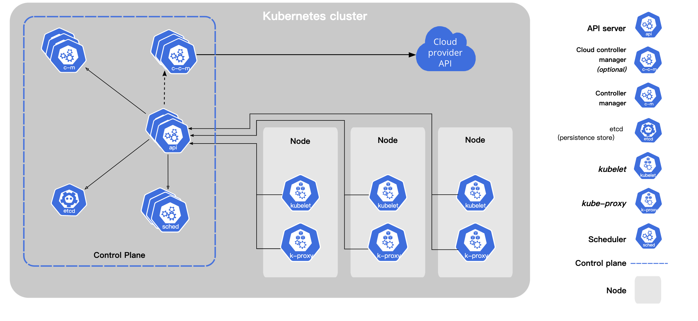

今天，我们看一下k8s的具体的组件有哪些，以及他的作用

<!--more-->

官方参考文档地址：https://kubernetes.io/docs/concepts/overview/components/

# Kubernetes组件

当你部署k8s的时候，你会部署一个集群。集群中有众多组件组成，包含很多被称之为==nodes==的工作节点，每一个集群至少包含一个node节点。

==node==中托管着很多pod。然后node和pod均由==control panel== 去管理，在生产环境中 control panel通常有很多，集群中通常也有很多node

下面我们详细介绍一下各个组件的作用

# Control panel 组件

Control panel 能够对整个集群做出全局的策略，比如任务调度，集群的检测和响应

Control panel可以在集群中的任何机器上运行。但是，为简单起见，设置脚本通常在同一台机器上启动所有控制平面组件，并且不在这台机器上运行用户容器

## kube-apiserver

api server是k8s为了暴露api接口的一个组件，是control panel 的一个前端。

他被设计为可以横向拓展，所以你可以部署很多机器，并且可以在这些机器中做负载均衡。

## etcd

一致且高度可用的键值存储，用作 Kubernetes 的所有集群数据的后备存储。

## kube-scheduler

观察新创建并且未分配的pod，并且选择一个node去运行。

调度决策考虑的因素包括：个人和集体资源需求、硬件/软件/策略约束、亲和性和反亲和性规范、数据局部性、工作负载间干扰和截止日期。

individual and collective resource requirements,

 hardware/software/policy constraints, 

affinity and anti-affinity specifications, 

data locality, 

inter-workload interference, and deadlines.

### kube-controller-manager

