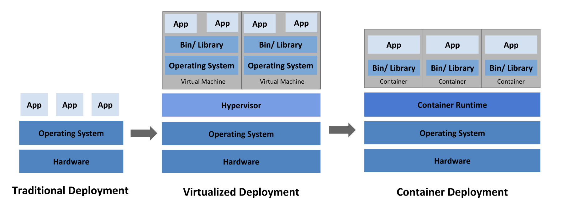

从今天起，开始整理k8s的笔记，深入学习k8s，第一节，什么是k8s，以及为什么引入k8s。

<!--more-->

k8s的官网地址为：https://kubernetes.io/docs/concepts/overview/what-is-kubernetes/

# 什么是k8s

Kubernetes 是一个可移植、可扩展的开源平台，用于管理容器化工作负载和服务，有助于声明式配置和自动化。它拥有庞大且快速发展的生态系统。Kubernetes 服务、支持和工具广泛可用。

Kubernetes 这个名字来源于希腊语，意思是舵手或飞行员。K8s 作为一个缩写，是通过计算“K”和“s”之间的八个字母得出的。Google 于 2014 年开源了 Kubernetes 项目。Kubernetes 结合[了 Google 超过 15 年](https://kubernetes.io/blog/2015/04/borg-predecessor-to-kubernetes/)大规模运行生产工作负载的经验以及来自社区的最佳创意和实践。

# k8s的作用

在了解这个问题之前，我们首先看一下早起架构的演变

> **传统的架构**

早期，部署在物理服务器上运行应用程序。无法为物理服务器中的应用程序定义资源边界，这会导致资源分配问题。例如，如果多个应用程序在物理服务器上运行，则可能会出现一个应用程序占用大部分资源的情况，结果其他应用程序的性能就会不佳。一个解决方案是在不同的物理服务器上运行每个应用程序。但这并没有扩展，因为资源没有得到充分利用，而且组织维护许多物理服务器的成本很高。

> **虚拟机部署时代**

这个时候看第二张图，在操作系统之上又引出了一个Hypervisor层，翻译过来就是管理层，管理层用来去管理在物理机上的各个虚拟机，虚拟机之间是独立的，不能相互访问，在虚拟机中部署的程序是相互独立的，这样就能解决上面的问题。但是这种部署，是比较重的，因为我们可以看到每一个虚拟机都要有一个操作系统

> **容器化部署时代**

容器类似于虚拟机，但它们具有放松的隔离属性，可以在应用程序之间共享操作系统（OS）。因此，容器被认为是轻量级的。与 VM 类似，容器有自己的文件系统、CPU 份额、内存、进程空间等。由于它们与底层基础架构分离，因此它们可以跨云和操作系统分布移植。

容器之所以流行，是因为它们提供了额外的好处，例如：

1. 敏捷的应用程序创建和部署：与使用 VM 映像相比，容器映像创建的简便性和效率更高。

2. 持续开发、集成和部署：提供可靠且频繁的容器映像构建和部署以及快速高效的回滚（由于映像不变性）。

3. Dev 和 Ops 的关注点分离：在构建/发布时而不是部署时创建应用程序容器映像，从而将应用程序与基础架构解耦。

4. 可观察性：不仅可以显示操作系统级别的信息和指标，还可以显示应用程序运行状况和其他信号。

5. 开发、测试和生产之间的环境一致性：在笔记本电脑上运行与在云中运行相同。

6. 云和操作系统分发可移植性：在 Ubuntu、RHEL、CoreOS、本地、主要公共云和其他任何地方运行。

7. 以应用程序为中心的管理：将抽象级别从在虚拟硬件上运行操作系统提高到使用逻辑资源在操作系统上运行应用程序。

8. 松散耦合、分布式、弹性、自由的微服务：应用程序被分解成更小的、独立的部分，并且可以动态部署和管理——而不是在一台大型单一用途机器上运行的单一堆栈。

9. 资源隔离：可预测的应用程序性能。

10. 资源利用：高效率、高密度。

> 了解完应用部署的架构演变之后，让我们再回头看一下，为什么需要k8s。

容器是捆绑和运行应用程序的好方法。在生产环境中，您需要管理运行应用程序的容器并确保没有停机。例如，如果一个容器出现故障，则需要启动另一个容器。如果这种行为由系统处理，会不会更容易？

这就是 Kubernetes 来救援的方式！Kubernetes 为您提供了一个框架来弹性地运行分布式系统。它负责您的应用程序的扩展和故障转移，提供部署模式等等。例如，Kubernetes 可以轻松地为您的系统管理金丝雀部署。

Kubernetes 为您提供：

- **服务发现和负载平衡** Kubernetes 可以使用 DNS 名称或使用自己的 IP 地址公开容器。如果容器的流量很高，Kubernetes 能够负载均衡和分配网络流量，从而使部署稳定。
- **存储编排** Kubernetes 允许您自动挂载您选择的存储系统，例如本地存储、公共云提供商等。
- **自动推出和回滚** 您可以使用 Kubernetes 描述已部署容器的所需状态，它可以以受控的速率将实际状态更改为所需状态。例如，您可以自动化 Kubernetes 为您的部署创建新容器、删除现有容器并将其所有资源用于新容器。
- **自动装箱** 你为 Kubernetes 提供了一个节点集群，它可以用来运行容器化的任务。你告诉 Kubernetes 每个容器需要多少 CPU 和内存 (RAM)。Kubernetes 可以将容器安装到您的节点上，以充分利用您的资源。
- **自我修复** Kubernetes 会重新启动失败的容器、替换容器、杀死不响应用户定义的健康检查的容器，并且在它们准备好服务之前不会将它们通告给客户端。
- **秘密和配置管理** Kubernetes 允许您存储和管理敏感信息，例如密码、OAuth 令牌和 SSH 密钥。您可以部署和更新机密和应用程序配置，而无需重新构建容器映像，也无需在堆栈配置中公开机密。

# k8s不是什么

Kubernetes 不是一个传统的、包罗万象的 PaaS（平台即服务）系统。由于 Kubernetes 在容器级别而不是硬件级别运行，因此它提供了一些常见于 PaaS 产品的普遍适用的功能，例如部署、扩展、负载平衡，并允许用户集成他们的日志记录、监控和警报解决方案。然而，Kubernetes 并不是单一的，这些默认的解决方案是可选的和可插拔的。Kubernetes 为构建开发者平台提供了构建块，但在重要的地方保留了用户的选择和灵活性。

Kubernetes：

- 不限制支持的应用程序类型。Kubernetes 旨在支持极其多样化的工作负载，包括无状态、有状态和数据处理工作负载。如果应用程序可以在容器中运行，它应该在 Kubernetes 上运行良好。
- 不部署源代码，也不构建您的应用程序。持续集成、交付和部署 (CI/CD) 工作流程由组织文化和偏好以及技术要求决定。
- 不提供应用级服务，例如中间件（例如，消息总线）、数据处理框架（例如，Spark）、数据库（例如，MySQL）、缓存，也不提供集群存储系统（例如，Ceph）作为内置服务。此类组件可以在 Kubernetes 上运行，和/或可以由运行在 Kubernetes 上的应用程序通过可移植机制（例如[Open Service Broker](https://openservicebrokerapi.org/) ）访问。
- 不规定日志记录、监控或警报解决方案。它提供了一些集成作为概念证明，以及收集和导出指标的机制。
- 不提供也不强制要求配置语言/系统（例如 Jsonnet）。它提供了一个声明性 API，可以针对任意形式的声明性规范。
- 不提供也不采用任何全面的机器配置、维护、管理或自我修复系统。
- 此外，Kubernetes 不仅仅是一个编排系统。事实上，它消除了编排的需要。编排的技术定义是执行已定义的工作流：首先执行 A，然后执行 B，然后执行 C。相比之下，Kubernetes 包含一组独立的、可组合的控制过程，它们不断地将当前状态驱动到提供的所需状态。从 A 到 C 的方式无关紧要。也不需要集中控制。这导致了一个更易于使用、更强大、更健壮、弹性和可扩展的系统。
