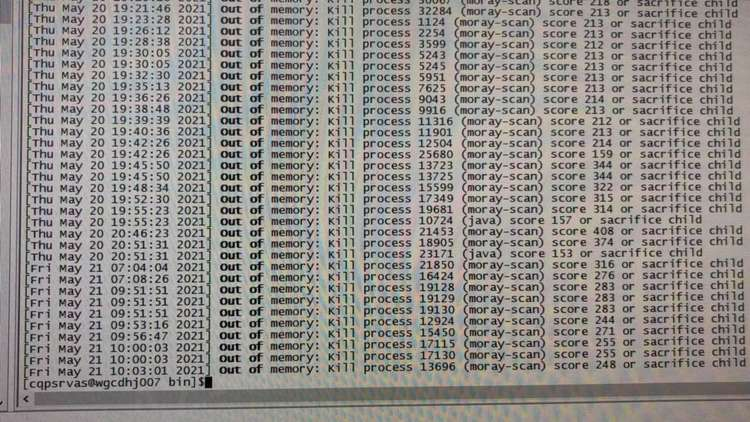

最近没有时间更新博客，今天放假前一天终于有时间了。先记录一下最近发生的服务莫名挂掉的问题吧

<!--more-->

## 情景

线上的服务总是莫名的挂掉，进程死掉。

## 排查

1. 先去看线上进程的日志，上线之前有gc日志的记录，发现没有发生重GC，也没有OOM的问题。

2. 用top命令去查当前的进程cpu的发现当前的java程序的cpu调用率不高
3. 基于以上种种，觉得不是现在java的问题。

==重点来了，隆重介绍以下命令==

**dmesg**

```shell
dmesg [-cn][-s <缓冲区大小>]
Linux dmesg命令用于显示开机信息。

kernel会将开机信息存储在ring buffer中。您若是开机时来不及查看信息，可利用dmesg来查看。开机信息亦保存在/var/log目录中，名称为dmesg的文件里。
```

我们用如下命令去排查

```shell
dmesg -T | grep 'Out of'
```



发现某些时间点，系统kill了java进程，原因是OOM，经过了解发现，这台服务器上还有Moray进程，在某些时间点有定时任务，会极大的占用内存，导致系统随机kill进程。

## 解决方案

1. 对服务器进行扩容操作
2. 对当前服务进行高可用的拓展。
