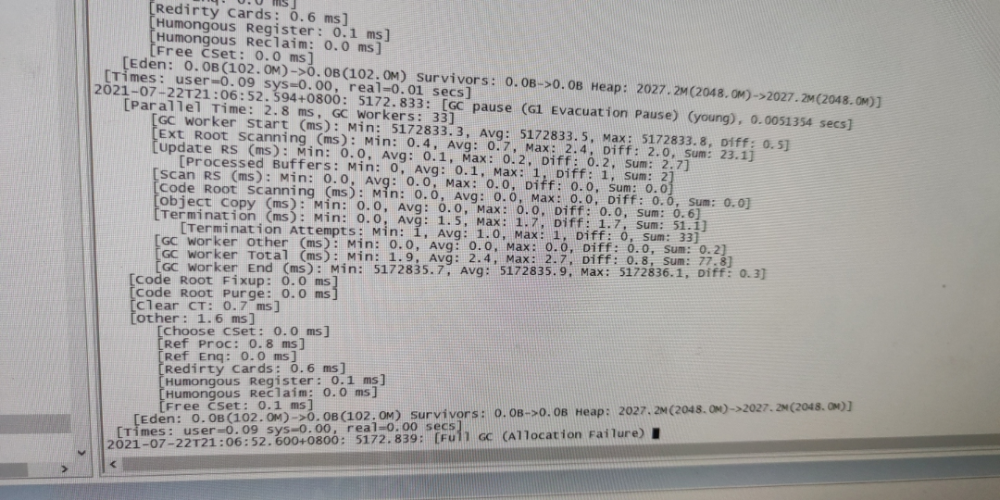
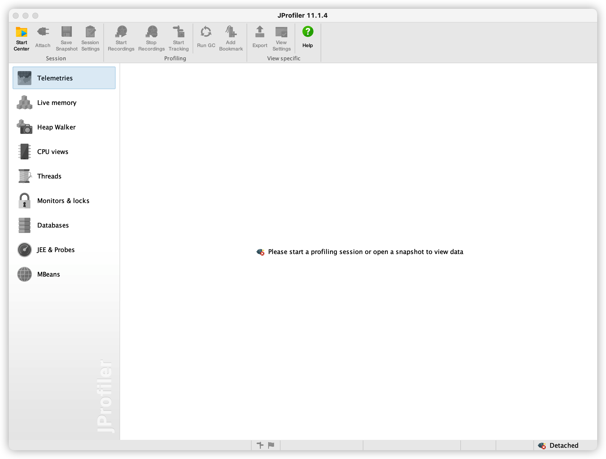
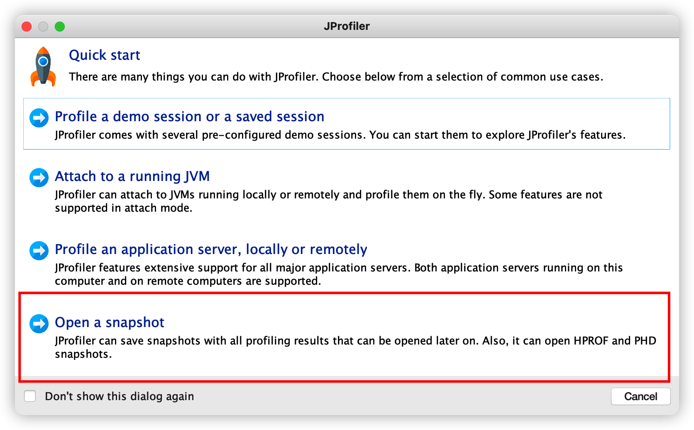
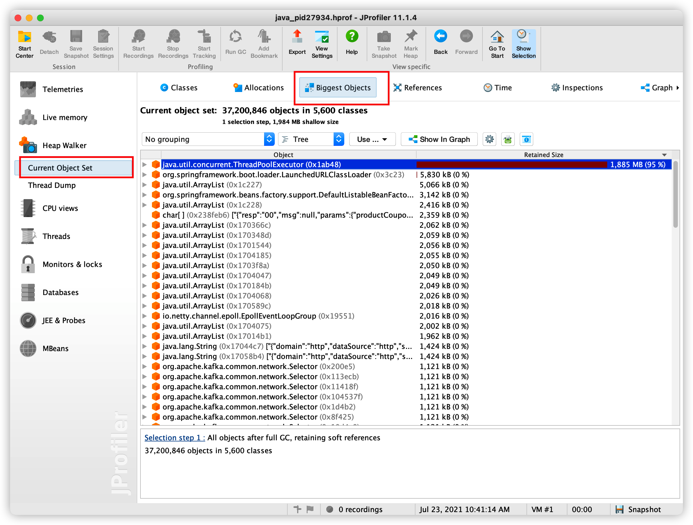

笔者在开发过程中遇到了几种情况的oom，特此记录一下排查及解决方案。
<!--more-->

# 1. 程序本身的oom问题

==现象== 

1. 程序处理异常缓慢 （假死）
2. 接口访问404 （真死）

## 1.1 定位问题

1. 查错误日志 

   日志明显的OOM错误信息

2. 查gc日志

   

   频繁的full GC

通过这两种方式，确认线上的问题是由于oom导致。

## 1.2 排查问题

oom的问题一般都是由大对象导致。首先拿到线上的dump文件，这边存在两种情况，下面逐一介绍。

1. 线上的启动脚本中未加入jvm参数，未在oom的时候拿到dump文件。

   1. 查找程序的pid

      ```shell
      ps -ef | grep ***
      ```

   2. 生成dump文件

      ```shell
      jmap -dump:format=b,file=heap.hprof ${pid}
      ```

      

2. 线上的启动脚本中已经有jvm参数

   依赖于启动脚本中是否加入了如下的参数

   ```shell
   -XX:+HeapDumpOnOutOfMemoryError
   -XX:HeapDumpPath=${目录}
   ```

dump文件拿取完成，一般是这个样子的


## 1.3 分析问题

笔者这边用的工具为JProfile，用法如下

1. 打开Jprofile

   

2. 选择打开快照文件



3. 查看大对象

   

可以查看到大对象，并由此定位到oom的问题。

## 1.2 非程序本身的问题

详情请看 [java服务莫名挂掉的线上排查](https://mrhy1996.github.io/online/)

