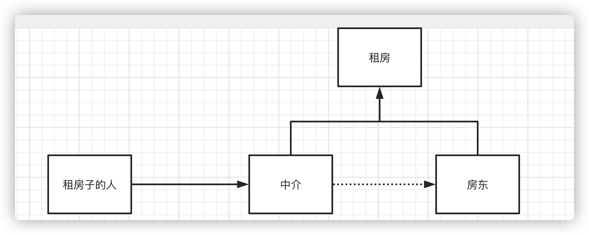

为什么要学习代理模式，因为这是springAop的底层实现。[springAop和springMvc]

<!--more-->



# 静态代理

角色分析

- 抽象角色：一般会使用接口或者抽象类来解决
- 真实角色：被代理的角色
- 代理角色：代理真实角色，代理真实角色之后一般我们会做一些附属操作
- 客户

代码

> 真实角色

```java
public class Host implements Rent {
    public void rent() {
        System.out.println("房东出租房子");
    }
}
```

> 代理

```java
public class Proxy implements Rent {
    Host host;

    public Proxy(Host host) {
        kanfang();
        this.host = host;
        money();
        qianhetong();
    }

    public Proxy() {
    }


    public void rent() {
        this.host.rent();
    }

    public void money() {
        System.out.println("收钱");
    }

    public void kanfang() {
        System.out.println("看房");
    }

    public void qianhetong() {
        System.out.println("签合同");
    }
}
```

> 接口（公共事情）

```java
public interface Rent {
    /**
     * 出租房子
     */
    void rent();
}
```

> 客户

```java
public class Client {
    public static void main(String[] args) {
        Host host=new Host();
        Proxy proxy = new Proxy(host);
        proxy.rent();
    }
}
```


代理模式的好处

- 使真实角色更加纯粹
- 公共也交给了代理角色，实现了业务的分工
- 公共业务实现了拓展可以集中管理

缺点

- 一个真实角色就会有产生一个代理角色，代码量会翻倍

# 动态代理

- 动态代理和静态代理角色一样
- 动态代理的动态类是自动生成的，不是我们之前写好的
- 动态代理分为两大类，基于接口的动态代理，基于类的动态代理
  - 基于接口：JDK动态代理
  - 基于类：clib
  - java字节码实现：javassist

需要了解2个类：Proxy 和 invocationHandler（调用处理程序）

代码

> 动态代理

```java
public class ProxyInvocationHandler implements InvocationHandler {
    private Object target;

    public void setTarget(Object target) {
        this.target = target;
    }

    //    Foo f = (Foo) Proxy.newProxyInstance(Foo.class.getClassLoader(),
//            new Class<?>[] { Foo.class },
//            handler);
    public Object getProxy() {
        return Proxy.newProxyInstance(this.getClass().getClassLoader(), this.target.getClass().getInterfaces(), this);
    }

    /**
     * @param proxy
     * @param method
     * @param args
     * @return
     * @throws Throwable
     */
    public Object invoke(Object proxy, Method method, Object[] args) throws Throwable {
        Object invoke = method.invoke(target, args);
        return invoke;
    }
}
```

> 真实角色

```java
public class Host implements Rent {
    public void rent() {
        System.out.println("房东出租房子");
    }
}
```

> 接口

```java
public interface Rent {
    /**
     * 出租房子
     */
    void rent();
}
```

> 客户

```java
public class Client {
    public static void main(String[] args) {
        Host2 host=new Host2();
        ProxyInvocationHandler pih = new ProxyInvocationHandler();
        pih.setTarget(host);
        Rent2 rent= (Rent2) pih.getProxy();
        System.out.println(rent.rent("a"));
    }
}
```

